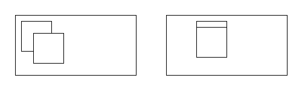
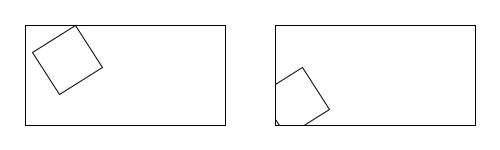

# Workshop 1: Generative Output

We'll explore different algorithms and techniques to generate visual output. The content for this workshop is based on the book [Generative Design](http://www.generative-gestaltung.de/1/) (and the book's example [code](https://github.com/generative-design/Code-Package-Processing-3.x/releases/tag/latest)) by Hartmut Bohnacker, Benedikt Groß, Julia Laub, and Claudius Lazzeroni. 

> In these workshop notes, the acronym "GD" refers to the Generative Design book. Related sections and code examples given using the format used in the book (e.g. **P.2.1.2** for sections, `P_2_1_2_01` for code).

## Goals

* Learn different generative rules to transform compositions and images 
* Experiment with autonomous agents to generate emergent patterns
* Use physical systems like attraction and repulsion to generate visual form

#### Required Reading and Viewing

Read the first chapter from Matt Pearson's book, _Generative Art_, **Generative Art: In Theory and Practice (1st edition)** [available through the school library online](https://learning-oreilly-com.proxy.lib.uwaterloo.ca/library/view/generative-art/9781935182627/kindle_split_013.html) and then watch [this 6-minute video about Casey Reas](https://www.youtube.com/embed/_8DMEHxOLQE) (Reas is pronounced like "Reese").

[](https://www.youtube.com/embed/_8DMEHxOLQE)

<!-- <iframe width="560" height="315" src="https://www.youtube.com/embed/_8DMEHxOLQE" frameborder="0" allow="autoplay; encrypted-media" allowfullscreen></iframe> -->

(If you liked that video, you should watch more from the _Creators Project_ series.)


# Set-Up

Several libraries and code need to be downloaded in preparation for the workshop.

#### 1. Install required libraries

* [**Ani**](http://www.looksgood.de/libraries/Ani/), a lightweight library for creating animations and transitions ([easing style cheat sheet](http://www.looksgood.de/libraries/Ani/Ani_Cheat_Sheet.pdf))
* [**ControlP5**](http://www.sojamo.de/libraries/controlP5/), a GUI library to build custom user interfaces 
* **GenerativeDesign**, a collection of various functions for generative design

> Use the menu `Sketch/Import Library.../Add Library...`, in the dialogue that opens, search for the library name and click "Install". 


#### 2. Download code from the Generative Design book

* [Generative Design Code Package for Processing 3.x](https://github.com/generative-design/Code-Package-Processing-3.x/releases/tag/latest)

> Post to Teams if you have trouble with setup. Please provide details so we can diagnose (e.g. operating system, error messages, steps to reproduce the error) 


# Workshop

In this workshop, we'll review different Processing code examples and do small exercises.

## Agents and Rules

A flexible way to create generative output is to encode drawing behaviour in an _Agent_. An Agent is simply an encapsulation class that maintains and updates its own state based on some rules, and then draws part of an image. The usual approach is to create many Agents so they work collectively to generate semi-autonomous output. 

### Grids of Agents 

#### Sketch: **`gridflip`** 

<!--  -->

A grid of Agents, each is a short line that can be tilted in one of two directions. Use the Gui menu (top left box) to adjust parameters and SPACE to pick a new random layout.

##### `Agent` Class

Have a look at the `Agent` class in `Agent.pde`. It's made up of:
- constructor: sets up its properties
  * The constructor is using `random(1)` and a threshold between 0 and 1 to make weighted pseudo-random decisions. For example `random(1) > 0.5` will be true about half the time, whereas `random(1) > 0.75` will be true about a quarter of the time.
- `update()`: called each frame, and can be used to update the agent's properties (e.g. position, speed, colour)
- `draw()`: using the current properties of the agent, draws the agent using Processing drawing commands

The code can easily switch between testing window and **full screen presentation**: comment out the `size()` line and uncomment the `fullScreen()` line. The tile number is chosen based on _size_ of tile, not _number_ of tiles across


##### `Gui` Class

As a tool to assist with development, the Processing sketches in this workshop each have a `Gui.pde` file. This contains code that can help you easily tweak parameters in your own code without rerunning it, by adding sliders to a menu.

- press `m` or `M` to hide and show menu
- press `S` to save an image of canvas

To add a slider to the menu, in `setup()`, add:
```
gui.addSlider(variableName, minimumValue, maximumValue);
```
where `variableName` is a string with the name of a variable to control, and `minimumValue`/`maximumValue` are the values to which to constrain the slider.

The values from the sliders can be used in one of two ways:
1. Create a global `float` variable with the same name as the passed `variableName`. When the slider is dragged, the variable will automatically update to the slider's value, and you can use it in `draw()`/etc.
2. Create a function with the same name as the passed `variableName` with a single `float` parameter. It will be called every time the slider is adjusted.


##### Review of Transformations in Processing

The agent is using Processing's transformation functions `translate()` and `rotate()` to position and orient itself.

Drawing code can be individually transformed by wrapping it in `pushMatrix(); [...] popMatrix();`. Otherwise, transformations will accumulate. For example, in the left image, the two translations are stacked on top of each other (the second square is at `(30, 30)`):
```java
translate(10, 10);
rect(0, 0, 50, 50);

translate(20, 20);
rect(0, 0, 50, 50);
```
whereas in the right image, the transformations are applied to the squares independently.
```java
pushMatrix();
translate(50, 10);
rect(0, 0, 50, 50);
popMatrix();

pushMatrix();
translate(50, 20);
rect(0, 0, 50, 50);
popMatrix();
```




The order of transformation is also important. The image on the left translates, then rotates the square (about its top left-corner):
```java
translate(50, 0);
rotate(1);
rect(0, 0, 50, 50);
```
whereas the image on the right rotates, then translates (the coordinate frame of the square is rotated too, so the square is translated along a direction in this coordinate frame):
```java
rotate(1);
translate(50, 0);
rect(0, 0, 50, 50);
```




* Transformation review (for more on this, see [Processing's tutorial](https://processing.org/tutorials/transform2d/))

#### Experiments

##### 1. Add code to make the agents randomly "flip". 

Create a new global variable that represents the chance that an Agent flips their angle _each second_.

```java
float flipChance = 0.01;
```

In `setup()`, add a slider to the GUI to adjust `flipChance`. 

```java
gui.addSlider("flipChance", 0, 1); 
```

Add code to `Agent.update()` to flip the angle randomly according on `flipChance`. 

```java
if (random(1) < flipChance/frameRate) {
  float a = -45;
  if (angle < 0) {
    a = 45;
  }
  angle = a;
}
```

> Why do you think `flipChance` is divided by `frameRate`?

Run your code and adjust the flipChance slider to see the effect.


##### 2. To bring the agents to life, try animating the angle change by inserting this code into `Agent.update()`:

```java
// angle = a;
Ani.to(this, 2, "angle", a, Ani.ELASTIC_OUT);
```

The [Ani library](http://www.looksgood.de/libraries/Ani/) is very useful. For example, try changing the [animation easing function](http://www.looksgood.de/libraries/Ani/Ani_Cheat_Sheet.pdf) in the code above from `Ani.ELASTIC_OUT` to something else.


#### Sketch: **`gridshape`** 

A grid of Agents, each is a small SVG image that turns towards the mouse or scales based on distance from the mouse.

To draw SVG images in Processing, `createAgents()` loads the file into a `PShape`:
```java
PShape shape = loadShape("module_" + shapeNum + ".svg");
```
and each agent draws it in `Agent.draw()` using the `shape()` function:
```java
shape(shape, 0, 0, s, s);
```

##### What's `atan2`?

`atan2(x, y)` can let you compute angles between things. It's similar to `atan(y/x)`, but has the benefit of also producing the correct angle even when x is less than or equal to zero.

`Agent.update()` uses `atan2()` to find the angle from the agent to the mouse:
```java
angle = degrees(atan2(mouseY - y, mouseX - x));
```

In short, to find the angle in degrees between two points `(ax, ay)` and `(bx, by)`, do:
```java
degrees(atan2(by - ay, bx - ax))
```


`Agent.update()` also uses the convenient `dist()` function to find the distance between the mouse and the agent:
```java
float d = dist(mouseX, mouseY, x, y);
```


#### Experiments

##### 1. Use the parameters to generate a static compositional form

Choose a shape and adjust the parameters (or the code itself) to create a form you like. Press 's' to save your final form to disk. If you like, you may include this image in your Public Digital Sketchbook entry.


##### 2. Create your own SVG shape to use for an agent

Use an online tool like [Method Draw](http://editor.method.ac/) or your favourite vector drawing program. The SVG should be about 100 by 100 pixels and have a completely transparent background. Simple shapes work great. It's important to offsetting them from the centre of the SVG image area to produce interesting effects (load one of the SVG shapes in the Data directory to see how they're offset). Try some alpha transparency for the fill and pick different colours too. Load this SVG into the code, and save a composition. If you like, you may include this image in your Public Digital Sketchbook entry.


#### Related

See also GD **P.2.1.1**, p. 206, and these code examples:
* `P_2_1_1_01` changing strokeweight and strokecaps on diagonals in a grid
* `P_2_1_1_04`: shapes in a grid, that are always facing the mouse


### Movement in a grid 

#### Sketch: **`gridmove`** 

Animating the change in position of circles in a grid using controlled random generators.

This sketch calls `Agent.update()` from event functions other than `draw()`: `draw()` is called each frame to enable the circles to animate, but `Agent.update()` is called when SPACE is pressed, updating the positions for the agents to animate towards

This sketch uses `randomSeed()` to seed the random number generator; this means that each time the code is run, the results of the `random()` calls (and the resulting composition) will be the same

See also GD **P.2.1.2**, p. 210, and these code examples:
* `P_2_1_2_01`: changing size and position of circles in a grid


### Pixels in a grid

#### Sketch: **`gridpixels`** 

Shows that agent rules can come from pixel information. Compare to GD sketch `P_4_3_1_01` which doesn't separate behaviours into agents and uses mouse input to vary parameters.

See also GD **P.4.3.1**, p. 302, and these code examples:
* `P_4_3_1_01`: pixel mapping; each pixel is translated into a new element


## Drawing with Agents

### Using kinematic rules

#### Sketch: **`drawlines`** 

Agents move around the canvas leaving a trail.

The agents follow a semi-random direction and step size: `maxStep` controls how far the agent can travel each step, and `probTurn` controls how much the agent rotates each step.

Setting `interact = true` turns on additional inter-agent behaviour. If the agents move within a close distance of each other, one agent gets deleted and the other accumulates its stroke weight.

> **Question:** One problem with this agent is that eventually they go too fast and it's hard to slow them down again: what code could you add to keep the speed in check?

### Using noise

#### Sketch: **`drawnoise`** 

Agents move around the canvas leaving a trail based on noise.

##### Perlin noise

This sketch uses Perlin noise (`noise()`), which enables generation of "smooth" pseudo-random sequences at various spatial or temporal frequencies.

These are examples of what Perlin noise looks like at different scales:


This is the code that was used to generate the above image:
```java
size(400, 100);
for (float factor : new float[] {0.01, 0.05, 0.1, 4}) {
  for (int x = 0; x < 100; x++) {
    for (int y = 0; y < 100; y++) {
      stroke((int)(255 * noise(x*factor, y*factor)));
      point(x, y);
    }
  }
  translate(100, 0);
}
```

(Run GD `M_1_4_01` to visualize noise function.) See also GD **M.1.5**, p. 335, and these code examples:
* `M_1_4_01`: creates a terrain like mesh based on noise values.
* `M_1_5_02_TOOL`:  noise values (noise 2d) are used to animate a bunch of agents


### Exercise: Make your own agent

Create your own drawing agent using the sketch `agentstarter`. This code has the basic shell for an agent-based drawing program, but all agents currently are initialized at the centre of the canvas and they don't move (look carefully, there's a small black dot at the centre). 


##### 1. Add code to to create kinematic drawing rules.

A simple drawing rule is to move to a random position nearby. Try adding the code below to `Agent.update()`:

```java
  void update() {
    // save last position
    px = x;
    py = y;

    // pick a new position
    x = x + random(-param, param);
    y = y + random(-param, param);
  }
 ```

##### 2. Run your code and adjust the _param_ slider in the Gui to see what happens. 

Adjusting the param slider makes it more or less random. You should change the param variable and slider name to be something meaningful, like "maxStepSize".


##### 3. Add a parameter to change a global drawing property.

For example, add a global parameter for the opacity of the stroke.

Create a global variable like:

```java
float opacity = 20;
```

Add code to create a Gui slider in `setup` (the string must be exactly the same as the variable name for the Gui to automatically change the value):

```java
  gui.addSlider("opacity", 0, 255);
```

Then use the variable in your agent code. In this case, in `draw`:

```java
  void draw() {
    // draw a line between last position
    // and current position
    strokeWeight(1);
    stroke(0, opacity); // using global opacity variable
    line(px, py, x, y);
  }
```

##### 4. To add variety to your drawing, add a parameter to your agent class so not all agents are the same. 

For example, add a local variable to the Agent class to store the agent's shade (grey value):

```java 
class Agent {

  float shade; 

  ...
 ```

 In the Agent constructor, pick a shade randomly. For example, this picks black or white:

```java 
    // pick a random grey shade
    shade = 255 * int(random(0, 2));
```

Then use this shade when you draw the agent:

```java
  void draw() {
    // draw a line between last position
    // and current position
    strokeWeight(1);
    stroke(shade, opacity); // using agent's shade variable
    line(px, py, x, y);
  }
```


##### 5. To add even more variety with interactive control, add a parameter to control how each agent picks a local behaviour parameter. 

We can go one step further and create a global parameter that controls a range to pick an agent parameter. For example, picking a random stroke weight to be assigned to each agent. 

Create a global variable called `maxWeight` and add it to the Gui. Think about a reasonable range for stroke weights in your drawing (thick lines can be interesting, even 100 looks great).

Add a variable called `weight` to the Agent class, so each agent can keep track of its own weight.

Now assign a random stroke weight in the Agent constructor like this:

```java
    // pick random stroke weight
    weight = random(1, maxWeight);
```

Add code to use the chosen weight when you draw:

```java
  void draw() {
    // draw a line between last position
    // and current position
    strokeWeight(weight); // using agent's weight variable 
    stroke(shade, opacity);
    line(px, py, x, y);
  }
 ```


##### 6. Add code to initialize agent positions.

So far, all agents start in the centre, the pattern of starting positions can have a huge effect on the drawing. 

For example, the starting position could be decided randomly by each Agent like this:

```java
  Agent() {
    // random starting position
    int m = 100; // margin
    x = random(m, width - m);
    y = random(m, height - m);
  }
```

Or by using the `Agent(x, y)` constructor, agents could be initialized in a grid by changing the `createAgents` function like this:

```java
void createAgents() {
  background(255);
  // create Agents in a centred starting grid
  agents = new ArrayList<Agent>();
  for (float x = 100; x < width - 100; x += 5)
    for (float y = 100; y < height - 100; y += 5) {
      Agent a = new Agent(x, y);
      agents.add(a);
    }
}
```

Or you could even spawn new agents as you draw a line, like this:

```java
void mouseDragged() {
  Agent a = new Agent(mouseX, mouseY);
  agents.add(a);
}
```

The ideas above are just a starting point. You could combine different initialization methods together, add more rules to control agent based on grid location, mouse speed, a noise function, what position the last agent had, etc.


##### 7. Experiment with more parameters or drawing rules.

Some ideas:

* add a rule that always pulls the agent in one direction (like all agents are pulled slowly downward)
* insert scale and rotate transforms, and make their arguments a global parameter or something different for each agent
* add a rule where agents track the mouse in some way (like `gridshapes`)
* add a rule that lets agents interact (like the code in `drawlines`)
* change how (or what) an agent draws, it could be bezier curves, ellipses, or multiple lines. Even 3D shapes or meshes.
* use an image, SVG shape, or mouse movement as a seed for agent movements. Give each agent access to the thing you want them to use as guidance, and they can (slightly) conform their movements to that shape, or their colour to the underlying pixel values, etc. 
* create a family of Agent classes that work together to create a drawing. Some agents could make highlights, some could be rectangular and others curvy, some could even insert text.

# Extras 

## Using Agents in Physical Simulations

The general idea of agent behaviour can be extended well beyond random or noise based decisions. 

### Attractors

* nodes and attractors
* forces
* tuning

See GD **M.4.0**, p. 392, and these code examples:
* `M_4_3_01_TOOL` a drawing tool using attractors
* `M_4_2_01` simple attractors

### Springs and Force-Directed Layout

See GD **M.6.1**, p. 436, and these code examples:
* `M_6_1_01` 200 nodes repel each other
* `M_6_1_03` nodes connected by springs


### Particle Systems

[Shiffman _Nature of Code_: Particle Systems](http://natureofcode.com/book/chapter-4-particle-systems/)

> You may need to add the line `import java.util.Iterator;` to the top of some sketches from this book since they were written for an older version of Processing.

### Genetic Algorithms

[Shiffman _Nature of Code_: The Evolution of Code](http://natureofcode.com/book/chapter-9-the-evolution-of-code/)

## Generative Output in 3D 

See GD **M.3.0**, p. 370, and these code examples:
* `M_3_2_04` generating different 3D meshes from formulas
* `M_3_3_0*` Mesh class demos
* `M_3_4_01_TOOL` interactive control of 3D mesh parameters 


# Exercise for Public Sketchbook

Continue to iterate the drawing agent you started in the exercise above ("Exercise: Make your own agent"), and post three generated images (just static PNG images is fine) that demonstrate the range of forms possible using your rules and parameter settings.


<!-- # References and Resources

* [Generative Design Book](http://www.generative-gestaltung.de/)
*  -->


 


