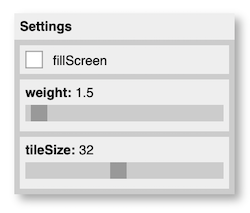
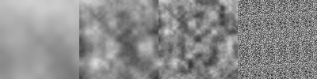

# Generative Art

In this workshop, we'll explore different algorithms and techniques to generate visual output. Some content in this workshop is inspired by the excellent book [**Generative Design: Visualize, Program, and Create with JavaScript in p5.js**](http://www.generative-gestaltung.de/2/) by Benedikt Groß, Hartmut Bohnacker, Julia Laub, and Claudius Lazzeroni. 

> In these notes, the acronym "GD" refers to the Generative Design book. Related book sections and [code examples from the book](http://www.generative-gestaltung.de/2/) are referenced using the same format used in the book (e.g. **P.2.1.2** for sections, `P_2_1_2_01` for code).

## Goals

* Learn different generative rules to transform compositions and images 
* Experiment with autonomous agents to generate emergent patterns
* Use physical systems like attraction and repulsion to generate visual form

## Recommended Reading and Viewing

Read the first chapter from Matt Pearson's book, _Generative Art_, **Generative Art: In Theory and Practice (1st edition)** [available through the school library online](https://learning-oreilly-com.proxy.lib.uwaterloo.ca/library/view/generative-art/9781935182627/kindle_split_013.html) and then watch [this 6-minute video about Casey Reas](https://www.youtube.com/embed/_8DMEHxOLQE) (Reas is pronounced like "Reese").

[](https://www.youtube.com/embed/_8DMEHxOLQE)

<!-- <iframe width="560" height="315" src="https://www.youtube.com/embed/_8DMEHxOLQE" frameborder="0" allow="autoplay; encrypted-media" allowfullscreen></iframe> -->

(If you liked that video, you should watch more from the _Creators Project_ series.)


<!-- # Set-Up

Several libraries and code need to be downloaded in preparation for the workshop.

#### 1. Install required libraries

* [**Ani**](http://www.looksgood.de/libraries/Ani/), a lightweight library for creating animations and transitions ([easing style cheat sheet](http://www.looksgood.de/libraries/Ani/Ani_Cheat_Sheet.pdf))
* [**ControlP5**](http://www.sojamo.de/libraries/controlP5/), a GUI library to build custom user interfaces 

> Use the menu `Sketch/Import Library.../Add Library...`, in the dialogue that opens, search for the library name and click "Install". 


#### 2. Download code from the Generative Design book

* [Generative Design Code Package for Processing 3.x](https://github.com/generative-design/Code-Package-Processing-3.x/releases/tag/latest)

> Post to Teams if you have trouble with setup. Please provide details so we can diagnose (e.g. operating system, error messages, steps to reproduce the error)  -->


# Agents and Rules

A flexible way to create generative output is to encode drawing behaviour in an _Agent_. An Agent is simply an encapsulation class that maintains and updates its own state based on some rules, and then draws part of an image. The usual approach is to create many Agents so they work collectively to generate semi-autonomous output. 

## Sketch: **`gridflip`** 

<!--  -->

This is a **grid of Agents**, each is a short line that can be tilted in one of two directions. Use the Gui menu (top left box) to adjust parameters and SPACE to pick a new random layout.

### Agent Class

Have a look at the `Agent` class in `agent.js`. It's made up of:
- constructor: sets up its properties
  * The constructor is using `random(1)` and a threshold between 0 and 1 to make weighted pseudo-random decisions. For example `random(1) > 0.5` will be true about half the time, whereas `random(1) > 0.75` will be true about a quarter of the time.
- `update()`: called each frame (in this particular sketch – it can be called elsewhere if desired), and can be used to update the agent's properties (e.g. position, speed, colour)
- `draw()`: using the current properties of the agent, draws the agent using Processing drawing commands

> The agent is using transformation functions `translate()` and `rotate()` to position and orient itself. We have a short review about this in the [course resources repo](). 


### Settings GUI

Am important part of generative coding is to interactively tweak key parameters used in your code while it runs. For this reason, many of the workshop demos use the [p5.gui library](https://github.com/bitcraftlab/p5.gui) (which extends and wraps the [quicksettings library](https://github.com/bit101/quicksettings)). 

 

A generic setup function is included in `utilities.js`. You can use this as follows.

In your main js file, create a JavaScript object to hold your settings, for example:
```js
// my parameters
let p = {
  // fillscreen param as a checkbox
  fillScreen: false,

  // weight param as a slider
  weight: 1,
  weightMin: 0.5,
  weightMax: 32,
}
```
I tend to use a single letter variable name (like `p` for "parameters") to make it easy to access in my code. 

In your `setup()`, call this helper function with your param object:

```js
// add params to a GUI
createParamGui(p);
```

**That's it!** Now you'll have a simple GUI to adjust your params when your program is running. All you need to do is reference them in your code like this:

```js
stroke(p.weight);
```

The GUI can be hidden or shown using the 's' key. 

There are often cases when you need to run some code every time a parameter changes. For this reason, you can call the helper function with an optional callback. 

```js
// add params to a GUI
createParamGui(p, paramChanged);
```

This example will call the function `paramChanged` every time a param is changed in the GUI. It will pass the name of the param that changed as a string.

```js
// global callback from the settings GUI
function paramChanged(name) {
  if (name == "tileSize" || name == "fillScreen") {
    createAgents()
  } 
}
```

### Full Screen Mode

The code can easily switch between a smaller testing window and **full screen mode** for presentation. Just enter full screen mode on your browser like normal (e.g. CTRL-COMMAND-F on MacOS Chrome) and click on 'fillScreen' in the GUI. The code uses the p5.js  `windowResized()` event callback function to do any resetting of the Agents when this happens. 


### Experiments

#### 1. Make the agents randomly "flip". 

Create a new parameter that represents the chance that an Agent flips their angle _each second_. In the params object `p`, add  a `flipChance` parameter and specify the min and max slider values for the GUI:

```js
// flip chance
flipChance: 0.01,
flipChanceMin: 0,
flipChanceMax: 1,
flipChanceStep: 0.01,
```

Add code to `Agent.update()` to flip the angle randomly according on `p.flipChance`. 

```js
if (random(1) < p.flipChance/frameRate()) {
    
    let a = -45;
    if (this.angle < 0) {
      a = 45;
    }
    this.angle = a;
  }
```

> Why do you think `p.flipChance` is divided by `frameRate()`?

Run your code and adjust the flipChance slider to see the effect.


#### 2. Bring Agents to life with animation. 

The flipping behaviour is instantaneous, adding some animation can really bring agents to life.  Try inserting this code into `Agent.update()`:

```js
// this.angle = a;
gsap.to(this, {angle: a, duration: 0.5} )       
```

This uses the [GreenSock animation library](http://www.looksgood.de/libraries/Ani/) to change the value of the Agent field `angle` to the new target value in `a` over a duration of 0.5 seconds.  This is called "tweening" or "keyframing". GreenSock will make this change in the background, and because we render Agents with those intermediate angle values at 60 FPS, we get an animation. Most GreenSock operations are triggered and configured using [the `gsap` object](https://greensock.com/docs/v3/GSAP). For example, try changing the `gsap.to` call to this:

```js
gsap.to(this, {angle: a, duration: 3, ease: "elastic.out(1.3, 0.3)"} )   
```
The [ease property](https://greensock.com/docs/v3/Eases) configures the timing and behaviour for tweening. Try experimenting with different `ease` types.  

## Sketch: **`gridshape`** 

Another grid of Agents, this time each is a small SVG image that turns towards the mouse and scales based on the distance from the mouse.

SVG files are images loaded using  `loadImage()`, here's how the first shape is loaded in setup():
```js
// load the SVG shape 
shape = loadImage("data/module_" + p.shapeNum + ".svg");
```

and each agent draws it in `Agent.draw()` using the `image()` function:
```js
image(shape, 0, 0);
```

### Loading an image with a "callback"

Here's how a new shape is loaded in paramChanged() (i.e. when a param is changed using the GUI):

```js
if (name == "shapeNum") {
  shape = loadImage("data/module_" + p.shapeNum + ".svg", 
    function () { createAgents(); });
}
```

The loadImage function has a second optional parameter for a "callback function". This is a function that's called after the image is completely loaded. In the code above, I create an "anonymous" function (note is has no name) as my callback, and the anonymous function only does one simple thing: call createAgents(). This means that createAgents is only called *after* the new shape is loaded and ready to be used.

### What's `atan2`?

`atan2(y, x)` computes angles between things. It's similar to `atan(y/x)`, but has the benefit of also producing the correct angle even when x is less than or equal to zero.

`Agent.update()` uses `atan2()` to find the angle from the agent to the mouse:
```js
// calculate angle between mouse position and actual position of the shape
this.angle = degrees(atan2(mouseY - this.y, mouseX - this.x));
```
In general, to find the angle in degrees between two points `(ax, ay)` and `(bx, by)`, do:
```js
degrees(atan2(by - ay, bx - ax))
```

`Agent.update()` also uses the convenient `dist()` function to find the distance between the mouse and the agent:
```js
let d = dist(mouseX, mouseY, this.x, this.y);
```


### Experiments

#### 1. Use the parameters to generate a static compositional form

Choose a shape and adjust the parameters (or the code itself) to create a form you like. Press 'S' to save your final form to disk. If you like, you may include this image in your Public Digital Sketchbook entry.

Here's the code to save the canvas to an image (which you download from the browser):
```js
function keyPressed() {
  // SHIFT-S saves the current canvas
  if (key == 'S') {
    save('canvas.png')
  }
}
```


#### 2. Create your own SVG shape to use for an agent

Use an online tool like [Method Draw](http://editor.method.ac/) or your favourite vector drawing program. The SVG should be *about* 100 by 100 pixels and have a completely transparent background. Simple shapes work great. You can offset them from the centre of the SVG image area to produce interesting effects (some of the SVG shapes in the data directory do this). Try some alpha transparency for the fill and pick different colours too. Add your SVG to your data directory, and save a composition. If you like, you may include this image in your Public Digital Sketchbook entry.

#### Related

See also GD **P.2.1.1**, and these code examples:
* [`P_2_1_1_01`](http://www.generative-gestaltung.de/2/sketches/?01_P/P_2_1_1_01) changing strokeweight and strokecaps on diagonals in a grid
* [`P_2_1_1_04`](http://www.generative-gestaltung.de/2/sketches/?01_P/P_2_1_1_04): shapes in a grid, that are always facing the mouse


## Sketch: **`gridmove`** 

Animates the change in position of circle Agents in a grid using controlled random generators.

This sketch calls `Agent.update()` from an event functions other than `draw()`: `draw()` is called each frame to enable the circles to animate, but `Agent.update()` is called when SPACE is pressed, updating the positions for the agents to animate to using GreenSock animation library.

This sketch uses `randomSeed()` to seed the random number generator; this means that each time the code is run, the results of the `random()` calls (and the resulting compositions) will be the same.

See also GD **P.2.1.2**, and these code examples:
* [`P_2_1_2_01`](http://www.generative-gestaltung.de/2/sketches/?01_P/P_2_1_2_01): changing size and position of circles in a grid

## Sketch: **`gridpixels`** 

Demonstrates how agent rules can come from pixel information. Here, each agent's colour is chosen as a pixel colour of an underlying image.  


See also GD **P.4.3.1**, and these code examples:
* Compare to GD sketch [`P_4_3_1_01`](http://www.generative-gestaltung.de/2/sketches/?01_P/P_4_3_1_01) which doesn't separate behaviours into agents and uses mouse input to vary parameters.
* [`P_4_3_1_02`](http://www.generative-gestaltung.de/2/sketches/?01_P/P_4_3_1_02): pixel mapping; each pixel is translated into a new element


## Sketch: **`drawlines`** 

Agents move around the canvas leaving a trail.

The agents follow a semi-random direction and step size: `maxStep` controls how far the agent can travel each step, and `probTurn` controls how much the agent rotates each step.

Setting `p.interact = true` turns on additional inter-agent behaviour. If the agents move within a close distance of each other, one agent gets reset and the other accumulates its stroke weight.

> **Question:** One problem with this agent is that eventually they go too fast and it's hard to slow them down again: what code could you add to keep the speed in check?


### Exercise: Make your own drawing agent

Create your own drawing agent using the sketch `agentstarter`. This code has the basic shell for an agent-based drawing program, but all agents currently are initialized at the centre of the canvas and they don't move (look carefully, there's a small black dot at the centre). 


#### 1. Add code to to create kinematic drawing rules.

A simple drawing rule is to move to a random position nearby. Try adding the code below to `Agent.update()`:

```js
// pick a new position    
this.x += random(-p.myParam, p.myParam);
this.y += random(-p.myParam, p.myParam);  
 ```

#### 2. Run your code and adjust the _myParam_ slider in the Gui to see what happens. 

Adjusting myParam slider changes how fast the agents move. You should change the myParam variable and slider name to be something meaningful, like "maxStepSize".


#### 3. Add a parameter to change a global drawing property.

For example, add a global parameter for the opacity of the stroke.

Add a new "opacity" parameter to your GUI by adding these properties to your `p` object (top of `sketch.js`), like this:

```js
let p = {

  ...

  // opacity of the agents
  opacity: 255,
  opacityMin: 0,
  opacityMax: 255,
}
```
Then use the variable in your agent code. In this case, in `Agent.draw()`:

```js
draw() {
    strokeWeight(1);
    stroke(0, p.opacity); // using global opacity variable
    line(this.px, this.py, this.x, this.y);
}
```

#### 4. To add variety to your drawing, add a parameter to your agent class so not all agents are the same. 

For example, add a field to the Agent class to store the agent's shade (grey value). In the Agent constructor, pick a shade randomly between black or white:

```js 
constructor() {
    ...

    // pick a random grey shade
    this.shade = random(255)
}
```

Then use this shade when you draw the agent:

```js
draw() {
    strokeWeight(1);
    stroke(this.shade, p.opacity); // using agent's shade variable
    line(this.px, this.py, this.x, this.y);
}
```


#### 5. To add even more variety with interactive control, add a parameter to control how each agent picks a local behaviour parameter. 

We can go one step further and create a global parameter that controls a range to pick an agent parameter. For example, picking a random stroke weight to be assigned to each agent. 

Create another GUI parameter called `maxWeight`. Think about a reasonable range for stroke weights in your drawing (thick lines can be interesting, even 100 looks great).

In the Agent constructor, initialize a new field called `weight` and assign a random stroke weight like this:

```js
// pick random stroke weight 
this.weight = random(1, p.maxWeight);
```
Now each Agent can keep track of its own stroke weight, and use the chosen weight in draw():

```js
draw() {
    strokeWeight(this.weight); // using agent's weight variable 
    stroke(this.shade, p.opacity); 
    line(this.px, this.py, this.x, this.y);
}
 ```


#### 6. Add code to initialize agent positions.

So far, all agents start in the centre, the pattern of starting positions can have a huge effect on the drawing. 

For example, the starting position could be decided randomly in the Agent constructor like this:

```js
constructor() {
  // random starting position
  let m = 100; // margin
  this.x = random(m, width - m);
  this.y = random(m, height - m);
}
```

Or by using an `Agent(x, y)` constructor like in the grid agent demos we saw earlier, agents could be initialized in a grid by changing the `createAgents` function. First change the Agent constructor to:
```js
constructor(x, y) {
    this.x = x; // width / 2;
    this.y = y; //height / 2;
    ...
```
Then in the createAgents function, change the main loop to:
```js
// create Agents
for (x = 100; x < width - 100; x += 5)
  for (y = 100; y < height - 100; y += 5) {
    let a = new Agent(x, y);
    agents.push(a);
}
```

Or you could even spawn new agents as you draw a line. Comment out the main loop that creates Agents in `createAgents` and create a p5.js mouse dragged event function, like this:

```js
function mouseDragged() {
  agents.push(new Agent(mouseX, mouseY));
}
```

A good extension to this would be to "kill off" agents after a few seconds, otherwise you'll be running thousands of agents which may make your sketch really slow.

The ideas above are just a starting point. You could combine different initialization methods together, add more rules to control agent based on grid location, mouse speed, a noise function, what position the last agent had, etc.


#### 7. Experiment with more parameters or drawing rules.

Some ideas:

* add a rule that always pulls the agent in one direction (like all agents are pulled slowly downward)
* insert scale and rotate transforms, and make their arguments a global parameter or something different for each agent
* add a rule where agents track the mouse in some way (like `gridshapes`)
* add a rule that lets agents interact (like the code in `drawlines`)
* change how (or what) an agent draws, it could be bezier curves, ellipses, or multiple lines. Even 3D shapes or meshes.
* use an image, SVG shape, or mouse movement as a seed for agent movements. Give each agent access to the thing you want them to use as guidance, and they can (slightly) conform their movements to that shape, or their colour to the underlying pixel values, etc. 
* create a family of Agent classes that work together to create a drawing. Some agents could make highlights, some could be rectangular and others curvy, some could even insert text.

# Extras 

## Sketch: **`drawnoise`** 

Agents move around the canvas leaving a trail based on a noise generation function.

### Perlin noise

This sketch uses Perlin noise (`noise()`), which enables generation of "smooth" pseudo-random sequences at various spatial or temporal frequencies.

These are examples of what Perlin noise looks like at different scales:



This is the code used to generate the image above:
```js
// perlin noise samples
function setup() {
  createCanvas(400, 100);

  for (f of [0.01, 0.05, 0.1, 4]) {
    for (x = 0; x < 100; x++) {
      for (y = 0; y < 100; y++) {
        stroke(255 * noise(x * f, y * f));
        point(x, y);
      }
    }
    translate(100, 0);
  }
}
```

GD [`M_1_3_03`](http://www.generative-gestaltung.de/2/sketches/?02_M/M_1_3_03) is a simple demo to help visualize the noise function and see how it transforms. 

## Using Agents in Physical Simulations

The general idea of agent behaviour can be extended well beyond random or noise based decisions. 


### Springs and Force-Directed Layout

* nodes and attractors
* forces
* tuning

See GD **M.6.1**, p. 436, and these code examples:
* [`M_6_1_01`](http://www.generative-gestaltung.de/2/sketches/?02_M/M_6_1_01) 200 nodes repel each other
* [`M_6_1_03`](http://www.generative-gestaltung.de/2/sketches/?02_M/M_6_1_03) nodes connected by springs


### Other Generative Methods

Daniel Shiffman's excellent [Nature of Code Book](https://natureofcode.com/) explains in detail other generative methods like [particle systems](http://natureofcode.com/book/chapter-4-particle-systems/) and [genetic algorithms](http://natureofcode.com/book/chapter-9-the-evolution-of-code/). Unfortunately, the book is from 2012 so all code examples use Java Processing (the precursor to p5.js). 

> **Update:** Shiffman is working on a [new version of the book](https://github.com/nature-of-code/noc-book-2) and [many of the demos are already translated into p5.js](https://github.com/nature-of-code/noc-examples-p5.js)! You can also watch videos demoing demo code from the book on his [Coding Train YouTube channel](https://youtu.be/70MQ-FugwbI).


# Sketchbook Entry

Continue to iterate the drawing agent you started in the exercise above, and post three generated images (just static PNG images is fine) that demonstrate the range of forms possible using your rules and parameter settings. Describe the parameters and drawing rules that you added.

Be prepared to share your creation next class.
