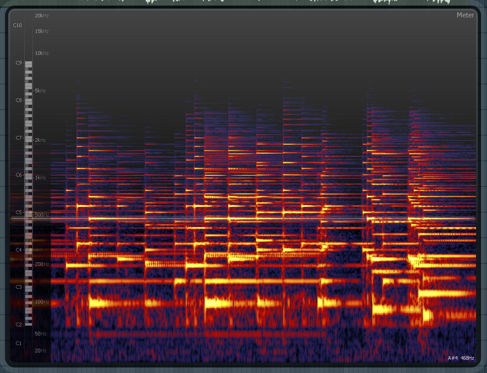

# Sound Workshop

Basic Tutorial for sound output. 

**Good Resources**

[Vanilla Sound](https://processing.org/reference/libraries/sound/index.html)

[Sound Github Repo](https://github.com/processing/processing-sound)

[Minim Github Repo](https://github.com/ddf/Minim/tree/master/examples)

[Minim Resource](http://code.compartmental.net/minim/audioplayer_class_audioplayer.html)

[Sounds Analysis Tutorial](https://www.youtube.com/watch?v=2O3nm0Nvbi4)

### Sounds Sources

[Free Sound](https://freesound.org/)

[Free Music Archive](freemusicarchive.org/)

### Tools

[Audio Spectrum Analysis](http://friture.org/download.html)

## Preliminaries

Download the `Sound` library and the `Minim` library from Processing's built-in library manager. 


## What is sound?

How does sound as a medium differ from the visual? What makes it unique? 

Sound is intrinsically physical and temporal. Unlike light waves, sound waves need a physical material to propagate through as well as an energy source (generator). When building compositions, we need to consider how these soundwaves are temporally spaced, the shape of the wave, and how they change over time. There are other properties of course, such as tone, timbre, richness, tempo, and rhythm that also need to be considered; but the entire domain of sound can be compacted into dimensions of time, shape, and change.

### The canvas

 


The human ear has a hearing range that falls between 20Hz to 20kHZ. Though, what we think of as "notes" will fall into the 60Hz to 6400Hz range, where middle "A" is 440Hz. 



Another way to visualize the sound spectrum is through analysis. The image above shows how audio changes over time (x-axis) and over the frequency range (y-axis). Colour indicates volume (amplitude). 


## Sound and Generative Art

Sounds, by itself, can be used as generative art. Philippe Pasquier and Arne Eigenfeldt explore this in their research into [Metacreation](http://metacreation.net/). 

For your projects, sound could offer five different utilities:

1. Input generation: seed values as a source of pseudo-randomness. 
2. Output generation: use additive and/or subtractive synthesis as a means of sound output.
3. Visualization: use music information retrieval (MIR) to analysis and produce visualization based on intrinsic properties. 
4. Monitoring: use external devices (i.e. microphones) to record or monitor the environment. 
5. Sampling: using pre-recorded audio and manipulation techniques (i.e. effects) to create soundscapes. 


## Visualization

Audio can be visualized in several different ways. The basic visualization techniques are to take the amplitude at moments in time and to use a Fourier transform (FFT). Both offer different analysis on what the underlying audio is doing. 

The key difference between the two is that `Amplitude` represents the total amount of output at a given time point while `FFT` represents output across the frequency domain, essentially breaking apart the waveform into its separate components. 

For visualization, there are three parameters to interpret: `amplitude`, `frequency`, and `time`. 

```
TODO:
Take one of the visualization sketches and modify it with your own interpretation. 
```

## Samplers

Demonstrates a variety of ways to get audio file playback. A good resource for sound samples can be found here [FreeSound](https://freesound.org/), midi can be found [here](https://www.classicalarchives.com/midi.html).

Algorithmic theory of [music 12-tone system](https://en.wikipedia.org/wiki/Twelve-tone_technique).

```
TODO:
- Find sound samples, and load them into a sketch. 
- Create Midi, Keyboard, or algorithmic playback. 
```


## Agents

One interesting way to create generative music is by introducing random or referential behaviour into the system. One way is to use multiple interacting agents (a kind of  [Metacreation](http://metacreation.net/)).

```
TODO:
- Take the SoundAgent sketch as a starting point
- Load your sound files
- Use the visualization techniques, and sampler behaviours to create interesting algorithm playback. 

```


