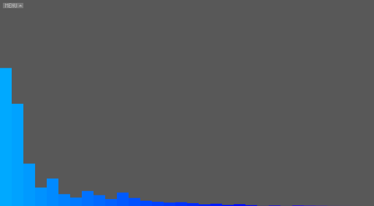
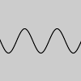
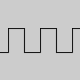
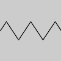
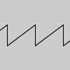
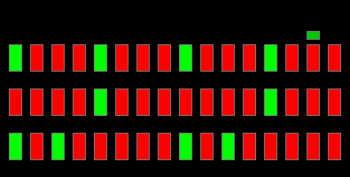

# Sound Workshop

We'll explore different approaches and techniques for integrating sound into generative art.


## Goals

- Learn different ways that sounds can be played, e.g., via sampling, synthesis using oscillators
- Learn different ways that sound can be used to drive visualizations, e.g., via amplitude tracking, frequency analysis
- Experiment with autonomous agents to generate emergent sounds


### Good Resources

- [Vanilla Sound](https://processing.org/reference/libraries/sound/index.html)
- [Sound Github Repo](https://github.com/processing/processing-sound)
- [Minim Github Repo](https://github.com/ddf/Minim/tree/master/examples)
- [Minim Resource](http://code.compartmental.net/minim/audioplayer_class_audioplayer.html)
- [Sounds Analysis Tutorial](https://www.youtube.com/watch?v=2O3nm0Nvbi4)

### Sounds Sources

- [Free Sound](https://freesound.org/)
- [Free Music Archive](freemusicarchive.org/)

### Tools

- [Audio Spectrum Analysis](http://friture.org/download.html)

## Preliminaries

Download the `Sound` library and the `Minim` library from Processing's built-in library manager. 


## What is sound?

How does sound as a medium differ from the visual? What makes it unique? 

Sound is intrinsically physical and temporal. Unlike light waves, sound waves need a physical material to propagate through, as well as an energy source (generator). When building compositions, we need to consider how these sound waves are temporally spaced, the shape of the wave, and how they change over time. There are other properties of course, such as tone, timbre, richness, tempo, and rhythm, that also need to be considered; but the entire domain of sound can be compacted into dimensions of time, shape, and change.

### The canvas

 


The human ear has a hearing range that falls between roughly 20Hz to 20kHz. Though, what we think of as "notes" will fall into the 60Hz to 6400Hz range, where middle "A" is 440Hz. 


Another way to visualize the sound spectrum is through analysis. The image above shows how audio changes over time (x-axis) and over the frequency range (y-axis). Colour indicates volume (amplitude). 


## Sound and Generative Art

Sound, by itself, can be used as generative art. Philippe Pasquier and Arne Eigenfeldt explore this in their research into [Metacreation](http://metacreation.net/). 

For your assignments, sound could offer five different utilities:

1. Input generation: seed values as a source of pseudo-randomness. 
2. Output generation: use additive and/or subtractive synthesis as a means of sound output.
3. Visualization: use music information retrieval (MIR) to analysis and produce visualization based on intrinsic properties. 
4. Monitoring: use external devices (e.g. microphones) to record or monitor the environment. 
5. Sampling: using pre-recorded audio and manipulation techniques (e.g. effects) to create soundscapes. 


## Visualization

Audio can be visualized in several different ways. Two basic visualization techniques are to take the amplitude at moments in time, or use a fast Fourier transform (FFT). Both offer different analysis on what the underlying audio is doing. 

For visualization, there are three parameters to interpret: `amplitude`, `frequency`, and `time`. 

The sketches in the `visualize` subdirectory explore these approaches using the Processing sound library.

### visualize/FFTBasic sketch

Shows a simple spectrum analyzer visualization for a playing audio file. Start with this sketch to understand how to analyze frequency spectrums using the Processing sound library.

The sketch plays the audio file on loop with:

```java
sample = new SoundFile(this, "Mecha_Action.aiff");
sample.loop();
```

To set up the FFT, the sketch does:

```java
fft = new FFT(this, bands);
fft.input(sample);
```

where `sample` is the `SoundFile` loaded before, and `bands` is the number of frequency bands to bin the frequencies into. This works like a histogram. The image on the left shows what 2 bands look like. The lighter blue bar represents lower (bass) frequencies, whereas the the darker blue bar represents higher (treble frequencies). With the image on the right, there are 32 bands, and so it's easier to pinpoint the more common frequencies. To update the number of "bands" set with the menu slider, press SPACE.




Finally, to get the frequency information, the sketch calls:

```java
fft.analyze();
```

and the result of the FFT is stored in the `fft.spectrum` array.

#### Exponential Smoothing

You will see the following code in several of the provided sketches:

```java
// Low pass filter
float rms = rmsPrev * (1 - smooth_factor) + raw * smooth_factor;  
```

This is a very useful piece of code, that you can even apply in contexts apart from sound. For example, this kind of filter can also be used to smooth the x-y motion of objects on-screen. It's called an [_exponential smoothing filter_](https://en.wikipedia.org/wiki/Exponential_smoothing). `smoothing_factor` can range between 0 and 1. A value of 0 means the raw value is entirely smoothed, ignoring changes in amplitude. A value of 1 applies no smoothing at all, taking in the raw value as-is. As `smoothing_factor` is set closer to 0, the new raw value (`raw`) contributes less to the resulting value (`rms`), effectively averaging out the bumps in the amplitude, and making it appear smoother.


### visualize/FFTSpectral

This sketch builds off the previous one, showing a spectrogram-like visualization of the audio file over time.

As with the previous sketch, to update the number of "bands" set with the menu slider, press SPACE. You can also press "p" then SPACE to change the visualization to a polar (radial) visualization.


### visualize/RMS

This sketch is a simple demo for how to use _amplitude_ rather than _frequency_ information from audio files using the Processing sound library. It shows an animated sphere that scales based on the current amplitude of the sound.

The audio file is loaded the same way as before, but an `Amplitude` object is made rather than an `FFT` object:

```java
rms = new Amplitude(this);
rms.input(sample);
```

The key difference between the two is that `Amplitude` represents the total "amount" of output at a given point in time, whereas `FFT` represents output across the frequency domain, essentially breaking apart the waveform into its separate components. 

Then, the sketch runs:

```java
float raw = rms.analyze();
```

to get the amplitude of the sound at the current moment in time. This is a floating point (decimal) number between 0 and 1.

### visualize/RMSBuffer and visualize/RMSLines

These two sketches are more complex versions of the RMS sketch. They both buffer (keep track of) the volume to show how it has changed over time. Explore both of these sketches to understand how they work.


#### Exercise 1

Take one of the visualization sketches and modify it with your own interpretation. Create a short (5–15 second) video demonstrating your resulting composition.


## Samplers

These sketches demonstrate a variety of ways to get audio file playback.

#### Good Resources
- Sound samples: [FreeSound](https://freesound.org/)
- MIDI files: [ClassicalArchives](https://www.classicalarchives.com/midi.html)
- Algorithmic theory of [music 12-tone system](https://en.wikipedia.org/wiki/Twelve-tone_technique)

### Simple Sound Effects – Samplers/VariableDelay

This simple sketch shows how to use the `Delay` effect in the Processing sound library. Pressing SPACE will play a sound, with parameters of the `Delay` effect controlled by the mouse position. This effect allows you to make a sound echo.

### Synthesizing Sounds – Samplers/SoundsCluster

This sketch shows how to use the `SinOsc` functionality of the Processing sound library to play multiple notes at different frequencies.

Rather than loading audio from a file, this sketch generates the sound itself using an _oscillator_, which is something that produces a repeating waveform, resulting in a sound. The Processing sound library supports four common types of oscillators: sine, square, triangle, and sawtooth.






These images show what the waveform produced by each oscillator looks like. The sine wave is a smooth-sounding tone. The square wave sounds reminiscent of wind instruments. The sawtooth wave sounds sharp, and is reminiscent of sounds from vintage video games. More complex sounds can be generated by playing multiple sounds at the same time, or by manually constructing a waveform using the `AudioSample` class.


### Sampling Sound Files – Samplers/SamplerKeyboard

This sketch loads multiple sounds samples and allows them to be played using the computer keyboard like an instrument. It also demonstrates the `Reverb` effect in the Processing sound library, which can make it seem like the sound is playing in a particular kind of space, for example, a large hall.


### Sampling Sound Files – Samplers/SamplerRandom

This sketch is similar to the previous one, but it randomly plays sounds over time, rather than playing sounds in response to keyboard input.


### Sampling Sound Files – Samplers/DrumMachine

This sketch demonstrates how Processing can be used to make a simple drum machine. The output shows a grid of boxes. The columns represent different points in time. The top, middle, and bottom rows correspond to a hi-hat, snare drum, and kick drum sound, respectively. Clicking on a red box will change it to green, and play the corresponding sound at that point in time, on loop.



Unlike the other sketches so far, this sketch uses the _Minim_ library, an alternative sound library for Processing that supports more complex features.


### Sampling Sound Files – Samplers/MidiViz

This sketch shows how to play a MIDI file using the `javax.sound.midi` library. It also visualizes the notes using 3D graphics – more on that coming in the 3D graphics workshop later in the term!

MIDI stands for _Musical Instrument Digital Interface_, and refers to a number of specifications, including a music file format. MIDI files only store the notes and instruments of a piece of music, like sheet music. This means that the file sizes are very small in comparison to normal audio files like MP3 and WAV. However, it also means that the computer playing the MIDI file needs to have a _sound bank_ with the sounds of different instruments, so it knows how to play it. Due to the compactness of the file format, many early computer music compositions were stored in MIDI or similar (e.g., MOD, XM) formats.


### Using MIDI Notes as Data – Samplers/SamplerMidi

Like the previous sketch, this sketch uses a MIDI file as a data source. But rather than playing the file directly, it plays the notes back manually using a triangle oscillator (see "Synthesizing Sounds" above for more info on oscillators). It also visualizes the note that's being played, similar to "piano roll" editors in many modern music creation software applications. This is an example of how you could use sound information to drive visuals in your assignments.

You'll also notice the variables `attackTime`, `sustainTime`, `sustainLevel`, `releaseTime` in this sketch. These refer to the "attack", "decay", "sustain", "release" (ADSR) envelope, which is ubiquitous in sound synthesis. Adding short fade-ins (attack) and fade-outs (release) can make synthesized sounds seem more natural. By carefully choosing parameter values, you can simulate phenomena like the piano hammer striking the strings in the piano, or plucking strings on a double bass.

The image below shows a visualization of how the four parameters affect the sound. The x-axis represents time; the y-axis represents the amplitude of the generated sound.


### Complex Example – Samplers/Synth

This sketch demonstrates how a synthesizer can be made using Minim, supporting several common synthesizer features.


#### Exercise 2

Take one of the "Samplers" sketches as a starting point. Try loading in your own sound files and changing the way the sound is visualized or played. Create a short (5–15 second) video demonstrating your resulting composition.


## Agents – SoundAgents/AgentSound

An interesting way to create generative music is by introducing random or referential behaviour into the system. One way is to use multiple interacting agents (a kind of [Metacreation](http://metacreation.net/)). This sketch builds off the `agentstarter` code in the previous workshop, to also introduce sound when agents interact.

#### Exercise 3

Take the SoundAgent sketch as a starting point. Try loading in your own sound files. Use one or more of the visualization techniques and/or sampling approaches described above to create a new form of interesting algorithmic playback. Create a short (5–15 second) video demonstrating your resulting composition.


## Entry for Public Digital Sketchbook

Provide a brief (approx. 250 word) description of the visualization and sampling techniques you used in the three exercises above. Attach or link to the three short videos you made in these exercises.

