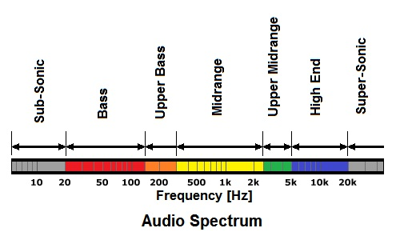

# Sound Workshop

We'll  explore different approaches and techniques for using sound in generative art.


## Goals

- Learn different ways that sounds can be played, e.g., via sampling, synthesis using oscillators
- Learn different ways that sound can be used to drive visualizations, e.g., via amplitude tracking, frequency analysis
<!-- - Experiment with autonomous agents to generate emergent sounds -->

## Setup

You'll need to include the p5.sound library in the `index.html` file that runs your script. The workshop demos load it as a local resource:

```html
<script src="libraries/p5.sound.min.js"></script> 
```

But you can also load it as a remote resource using CDN:

```html
<script src="https://cdnjs.cloudflare.com/ajax/libs/p5.js/1.4.0/addons/p5.sound.min.js"></script>
```

## Resources

### p5.js Sound Resources and Tutorials

- [p5.sound library reference](https://p5js.org/reference/#/libraries/p5.sound)
- [Daniel Shiffman's Sound Tutorials](https://www.youtube.com/playlist?list=PLRqwX-V7Uu6aFcVjlDAkkGIixw70s7jpW)
-  [Allison Parrish's Sound Tutorial](https://creative-coding.decontextualize.com/synthesizing-analyzing-sound/)

### Media Assets

- [**Freesound**](https://freesound.org/): "Freesound aims to create a huge collaborative database of audio snippets, samples, recordings, bleeps, ... released under Creative Commons licenses that allow their reuse."
- [**Free Music Archive**](https://freemusicarchive.org/): "Free Music Archive is known for free to download music licensed under Creative Commons."
<!-- - [ClassicalArchives](https://www.classicalarchives.com/midi.html) -->

### Tools

- [**Friture**](http://friture.org/download.html): a tool for audio spectrum analysis


# Introduction

How does sound as a medium differ from the visual? What makes it unique? 

Sound is intrinsically physical and temporal. Unlike light waves, sound waves need a physical material to propagate through, as well as an energy source (generator). When building compositions, we need to consider how these sound waves are temporally spaced, the shape of the wave, and how they change over time. There are other properties of course, such as tone, timbre, richness, tempo, and rhythm, that also need to be considered; but the entire domain of sound can be compacted into dimensions of time, shape, and change.

## The sound "canvas"

The human ear has a hearing range that falls between roughly 20Hz to 20kHz. For music, we think of as "notes" that fall into the 60Hz to 6400Hz range, where middle "A" is 440Hz. 

 

Another way to visualize the sound spectrum is through analysis. The image above shows how audio changes over time (x-axis) and over the frequency range (y-axis). Colour indicates volume (amplitude). 


## Generative Sound in Generative Art

Sound, by itself, can be used as generative art. Philippe Pasquier and Arne Eigenfeldt explore this in their research into [Metacreation](http://metacreation.net/). 

In digital artwork, sound can function in three primary ways:


1. **Augmentation**: use sound to embellish or extend a visual artwork.
1. **Analysis:** generate an artwork by analyzing properties of sound.
2. **Synthesis:** use additive or subtractive synthesis to generate sound art.
<!-- 3. **Sampling:** using pre-recorded audio and manipulation techniques (e.g. effects) to generate sound are. 
4. **Monitoring:** use external devices (e.g. microphones) to record or monitor the environment. 
5. **Input generation:** seed values as a source of pseudo-randomness.  -->

In this workshop we demonstrate techniques for each of these.

# Augmentation

Perhaps the simplest way to use sound is to extend or enhance a visual artwork. 

## Sketch: **`gridfliptick`**

Extends an animated version of the `gridflip` demo from the previous workshop with added sound effects. 

### Loading Sound

Like images, sounds are loaded "asynchronously" which means the variable you use for the created sound may not be ready to be used right away. The easiest way to handle this is to load sound files in `preload`:

```js
// my sound file
let tick;

function preload() {
  tick = loadSound("data/254316__jagadamba__clock-tick.wav")
}
```

Preload is called before setup and it guarantees that `tick` will be loaded with the wav file and ready to use before setup, draw, mousePressed, etc. are run.

### Playing Sound

Playing sound is slightly more complicated on modern browsers. They all have restrictions like Chrome's [autoplay policy](https://developer.chrome.com/blog/autoplay/#webaudio) that prevents web pages from playing sounds without some user interaction like clicking on typing anywhere on the page first.  There used to be [some ways to hack around this](https://olafwempe.com/how-to-enable-audio-and-video-autoplay-with-sound-in-chrome-and-other-browsers-in-2019/), but things have been tightened up.

> **If you don't hear any sound, just click somewhere on the webpage and the sound should start.** You'll see warnings in the console if your sound is being ignored due to a browser policy. 


### Adjusting Playback

A [sound file has many more methods](https://p5js.org/reference/#/p5.SoundFile) than `play()`. In this demo, we adjust the volume since the wav file I used it really loud. I do this in `setup()` since:

```js
// turn down the sound
tick.setVolume(0.1);
```

### Exercise: Make a Stereo Tick

You can change "where" the sound plays in the left or right stereo channel using the [`pan()` method](https://p5js.org/reference/#/p5.SoundFile/pan). A value of -1 means play in the left channel, 1 means play in the right channel, and anything in between is a mix of both channels (i.e. the default value of 0 plays in both channels equally).

Let's pan the tick sound to match the horizontal canvas position of the Agent that's flipping. Add this code to `Agent.update()` just before the `tick.play()` line:

```js
// map agent x canvas position to a [-1, 1] stereo pan
let p = map(this.x, 0, width, -1, 1)
tick.pan(p)
```
> **Note:** You may need to listen with stereo headphones to really hear the effect. 


### Explore: Add More Sounds and/or Variation

* You could vary the volume of the tick based on Agent position or some pseudo random choice.
* You could experiment with the [rate() method](https://p5js.org/reference/#/p5.SoundFile/rate) to play the tick more slowly (or even backwards) depending on where the Agent is or some pseudo random choice.
* You could play a different sound depending on the flip direction. 
* You could choose to play one of a few different sounds at each flip. 
* Every agent could have its own sound, or maybe there are N type of agents that all share the same sound. 
  
For the additional sounds, could download a new sound on [**Freesound**](https://freesound.org/), create another variation of the tick wav using audio processing software, or record your own sound using your mic.


# Analysis

Two basic analysis techniques are to calculate the amplitude of a sound at a moment in time, or use a fast Fourier transform (FFT) to examine different frequencies of sound at a moment in time. 

> **Awesome Resource:** You need to check out this [The Pudding](https://pudding.cool/) interactive data visualization essay ["Let's Learn about Waveforms"](https://pudding.cool/2018/02/waveforms/). Not only is it an excellent technical explanation of sound that's highly relevant to this workshop, but the design of this "essay" (and many others on that site) is incredible. 

## Sketch: **`amplitudeviz`**

This sketch demonstrates how to analyze amplitude information from audio files. It visualizes amplitude as an animated disk that scales based on the current amplitude of the sound. The highest peak amplitude is visualized as a circle.

The sketch plays the audio file that loops:

```js
sound.play()
sound.setLoop(true)
```

The audio file is loaded the same way as before, but an `Amplitude` object is created and associated with the sound file. 

```js
amplitude = new p5.Amplitude(p.smoothing);
amplitude.setInput(sound);
```
Then, the sketch runs the current amplitude level is computed:

```js
  let level = amplitude.getLevel();

```
This is a floating point (decimal) number between 0 and 1. You may find that audio never reaches 1 due to how the sound file was recorded. You can "normalize" the amplitude level to be 0 to 1 for the current sound file with [`.toggleNormalize(true)`](https://p5js.org/reference/#/p5.Amplitude/toggleNormalize). Try adding this to the end of the `initalizeAnalysis()` function:

```js
// normalization
amplitude.toggleNormalize(true);
```

### Animation Technique Extra

The peak value is rendered using a GreenSock animation with some more advanced usage. The peak level and opacity are all stored in a `peak` object. 

```js
// peak object 
let peak = {
  level: 0,
  opacity: 0,
}
```

The gsap tween has a callback to reset the peak level after the animation finishes, but a new tween "overwrites" any previous ones (i.e. the callback is only triggered when the animation fully completes). 

```js 
// start new animation with callback function on completion
// animated value "opacity" is a member of the object "peak"    
// overwrite: true kills any animation already running
gsap.to(peak, {
    opacity: 0, 
    duration: 1.0, 
    overwrite: true,
    onComplete: function () {
    print(`peak ${peak.level} completed`);
    peak.level = 0;
    }
})
```


## Sketch: **`frequencyviz`**

Demonstrates a variety of frequency-related analysis of a sound file, all based on the Fast Fourier Transform (FFT). The key difference between is that `Amplitude` represents the total "amount" of output at a given point in time, whereas `FFT` represents output across the frequency domain, essentially breaking apart the waveform into separate components. 

Start with this sketch to understand how to analyze frequency spectrums using the [p5.FFT](https://p5js.org/reference/#/p5.FFT) object.


To set up FFT analysis, the demo creates a p5.FFT object like this:

```js
soundFFT = new p5.FFT(p.smoothing, 2 ** p.bins);
soundFFT.setInput(sound);
```

Setting the amount of smoothing and the number of bins is optional, but this demo controls them with the GUI. If you don't call `setInput` with a p5.Sound object, then the FFT analysis will be on all sound produced by the sketch. 

The [p5.FFT](https://p5js.org/reference/#/p5.FFT) methods used:
* `soundFFT.analyze()` performs the FFT analysis on the current sound sample
* `soundFFT.waveform()`
* `soundFFT.getCentroid()` 
* `soundFFT.getEnergy()`

> **The FFT spectrum is often visualized as a "spectrogram",** essentially all the spectrum samples are visualized smeared over time. You can see a demo of this in p5.js on [Allison Parish's sound tutorial](https://creative-coding.decontextualize.com/synthesizing-analyzing-sound/) (search for "smearing").


## Experiment: Analyze Live Audio

It's quite easy to capture and analyze live audio from your microphone. In the `setup` function in the **frequencyviz** demo, comment out `sound.play()` and add code to capture sound from the microphone instead:

```js 
// sound.play()
// sound.setLoop(true)
sound = new p5.AudioIn()
sound.start()
```

1. See how well you can control the sound with your voice or making noises with found objects. 
2. Think about how you could use your voice as an input for the generative art works from workshop 1. For example, **flipgrid** could use some part of sound frequency analysis instead of a random number to decide when (and maybe how) to flip lines. 


# Synthesis

These sketches demonstrate a variety of ways to get audio file playback.

## Sketch: **`effects`**

Sounds can be processed by audio effects using [p5.Effect](https://p5js.org/reference/#/p5.Effect) classes. This demo lets you process short clips from your mic with different effects.

Try switching the effect and the effect parameters in the `paramChanged` function. For example, this turns on a [p5.Delay](https://p5js.org/reference/#/p5.Delay) effect to create something like an echo:

```js
effect = new p5.Delay();
effect.process(clip, 0.12, .7, 2300);
```

Effects are connected or disconnected to a sound: think of it like something the sound is passed through when its played. 

### Recording

This sketch shows how to make a recording of a sound (in this case the mic) and then play it back. 

You need three objects:

```js 
let mic;      // p5.AudioIn object to capture the mic
let clip;     // p5.SoundFile we record to
let recorder; // p5.SoundRecorder that does the recording
```

Create and connect everything (usually in `setup`):

```js
// setup mic capture
mic = new p5.AudioIn();
mic.start();

// create a sound recorder
recorder = new p5.SoundRecorder();
recorder.setInput(mic);

// create an empty sound file to record to
clip = new p5.SoundFile();  
 ```

This demo records for a set amount of time from the GUI and the `recordingDone` callback function is called when the recording is finished. 

```js
recorder.record(clip, p.clipLength, recordingDone)
```

You could also use `recorder.record(clip)` to start and `recorder.stop()` to end the recording manually.

> Due to browser media playback policies, you may need to call  `userStartAudio()` on a key or mouse event. This demo does this in `keyPressed()`.

## Sketch: **`oscillators`**

Rather than loading or recording audio to play and manipulate, this sketch generates the sound itself using an _oscillator_. This is something that produces a repeating waveform, resulting in a sound. You should also read [Allison Parish's "Synthesizing and analyzing sound" tutorial](https://creative-coding.decontextualize.com/synthesizing-analyzing-sound/) which is an excellent introduction to oscillators with p5.sound.

The [p5.Oscillator](https://p5js.org/reference/#/p5.Oscillator) class supports four common types of oscillators: sine, square, triangle, and sawtooth. These images show what the waveform produced by each oscillator looks like: 


* **sine** produces a smooth-sounding tone. 
* **square** produces a sound reminiscent of wind instruments. 
* **sawtooth** creates sounds reminiscent of vintage video games. 
  
For example this code creates a sine oscillator, sets its frequency to 440Hz, and starts it playing:

```js
// create an oscillator 
osc = new p5.Oscillator('sine')
osc.freq(440)
osc.start()
```

The demo starts playing after SPACE is pressed (due to browser media playing policies) and new oscillators are created in the GUI param callback function.

### Exercise: Make an Instrument

Let's change the continuous tone to one that fades quickly over time like a note played by an instrument. Comment out the code in the `keyPressed` function and replace it with this:

```js 
if (key == " ") {
  osc.amp(p.amp) 
  osc.amp(0, 0.8) // ramp down the amplitude 
  osc.start()
}  
```

The first call to `amp` sets the amplitude (volume) to the value you chose in the GUI. The second call to `amp` will "ramp down" the amplitude to 0 over 0.8 seconds. This produces a single note, like an instrument. Experiment with different times, or even better, add this ramp down time to your GUI.

You'll also want to comment out where the amp is set in the paramChanged GUI callback, or else you'll hear a continuous tone when you adjust the amplitude:

```js
    // osc.amp(p.amp)
```

To play different notes, we'll use the horizontal mouse position in the canvas.  Insert this code right after `osc.start()` in `keyPressed`:

```js
  let f = map(mouseX, 0, width, 220, 784)
  osc.freq(f)
```

This maps the mouseX position to a frequency between 220 Hz and 830 Hz (which [corresponds to about 2 octaves from A4 to G5](https://www.inspiredacoustics.com/en/MIDI_note_numbers_and_center_frequencies)). 

You'll notice that if you play two notes quickly, the note that was still playing is cut off. This produces some strange sounds which may not be desirable. The reason is that we're using a single oscillator object, and each time we play a note we're resetting the current oscillator amplitude to play the new note.

A simple fix is to create a new oscillator object for every note by inserting this line before `osc.amp(p.amp)`: 

```js
  osc = new p5.Oscillator(p.oscillator)
```

### Experiment 1: Tremelo and Vibrato

Read the "Controlling oscillators with oscillators" section of [Allison Parish's "Synthesizing and analyzing sound" tutorial](https://creative-coding.decontextualize.com/synthesizing-analyzing-sound/). Try adding tremelo and vibrator effects to your oscillator instrument.

### Experiment 2: ADSR Envelope

The simple "ramp down" of amplitude we used above is only one way to change the sound of single "note". One standard method to change the sound of a note is my dividing the amplitude into four parts: "attack", "decay", "sustain", "release", which are collectively called the ADSR envelope.  Adding short fade-ins (attack) and fade-outs (release) can make synthesized sounds seem more natural. By carefully choosing parameter values, you can simulate phenomena like the piano hammer striking the strings in the piano, or plucking strings on a double bass.

The image below shows a visualization of how the four parameters affect the sound. The x-axis represents time; the y-axis represents the amplitude of the generated sound.


The [p5.Envelope](https://p5js.org/reference/#/p5.Envelope) class lets you control an oscillation tone with an ADSR envelope. Look at the demo code on the reference page, and add add code to play your oscillator through an ADSR envelope. 

*Hints:*

* You'll need to add code to `keyPressed` to `play` your `osc` oscillator with the p5.Envelope object you create. 
* You'll need to comment out the amp "ramp down" code too, or else the envelope won't have complete control over how the oscillator is played.

Try adding GUI parameters to control the four ADSR parameters, this will make your program like a music synthesizer.

You could also use [`triggerAttack`](https://p5js.org/reference/#/p5.Envelope/triggerAttack) and `triggerRelease`. Instead of playing the envelope all at once with `play`, these let you play the attack and decay part when a key is pressed and then play the release part when SPACE is released. 

You can also try the [p5.PolySynth](https://p5js.org/reference/#/p5.PolySynth) class which provides even more control over playing sound.  


<!-- ## Sketch: **`midi`**

MIDI stands for _Musical Instrument Digital Interface_, and refers to a number of specifications, including a music file format. MIDI files only store the notes and instruments of a piece of music, like sheet music. This means that the file sizes are very small in comparison to normal audio files like MP3 and WAV. However, it also means that the computer playing the MIDI file needs to have a _sound bank_ with the sounds of different instruments, so it knows how to play it. Due to the compactness of the file format, many early computer music compositions were stored in MIDI or similar (e.g., MOD, XM) formats. -->

# Sketchbook Entry

Extend one of the exercises or experiments above into a small demo of your own. Attach or link to your creation: this could be screen capture recording or live code (e.g. hosted in the p5 online editor). Include a brief description (about 250 words) to explain what you did and how it works.

Be prepared to share your creation next class.
