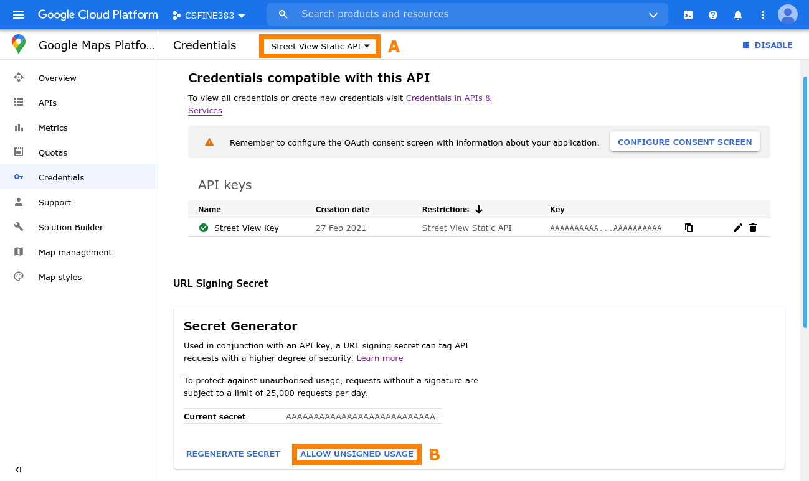
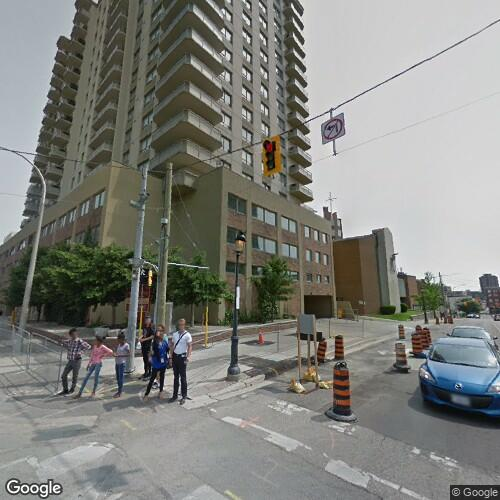
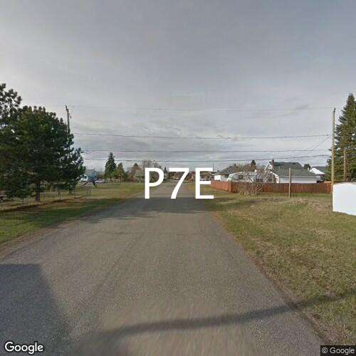

# Workshop 4: Data

Learn about a variety of ways to access data, process it, and some ideas what to do with it.

## Goals

* Use `loadStrings` to read in lines of text and perform basic text processing.
* Use `Table` to load and index data from a CSV file.
* Use `XML` to load and search for content in a RSS feed.
* Create querystring URLs to access data.
* Use `JSONObject` to process responses from data sources.
* Learn about OAuth and APIs like Twitter's


<!-- #### Required Reading

**  -->

# Set Up

Make sure to complete the following steps before working with the Workshop code.

#### 1. Install required libraries

* **Simple Tweet** for reading and posting to Twitter

Do this just like you did for the Video libraries in Workshop 0. Using `Sketch/Import Library.../Add Library...`, search for the library name and click "Install". 

#### 2. Verify the libraries work

To test the Simple Tweet library, try running the `SearchTwitter` sketch from the the `Contributed Folders` tree folder in `File/Examples...`. Since you haven't setup OAuth yet, the sketch will crash with a message beginning with an "ArithmeticException: /by zero" error and a message in the console starting with "401:Authentication credentials." As long as you see the same error and message for the crash, everything should be installed correctly. Later on in the workshop, you can set up OAuth for Twitter.

> Post to Teams if you have trouble running the library demos. Please provide details so we can diagnose (e.g. operating system, error messages, steps to reproduce the error). 

#### 3. Get the latest "Workshop" code from Gitlab

If you have Git installed on your computer, and you already cloned the course workshop gitlab project (see Workshop 0), this could be as easy as typing `git pull` in the terminal.

#### 4. Create a Twitter and Google account if you don't already have them

You'll need these accounts to search for tweets using code and to use the Google Maps API.


# Workshop

In this workshop, we'll review the different Processing code examples in this directory. Each sketch serves to demonstrate techniques to get historical, current, or real-time data that could be used as input.

## Text

#### Sketch: **`text`** 

This is a minimal sketch showing how to load text from a file. The output is printed to the Processing console (there is no graphical output).


It uses the `loadStrings()` built-in function to load the lines of the specified file as an array of strings (text):
```java
String[] lines = loadStrings(fn);
```
`loadStrings()` also works for loading remote content, by passing a url. Try commenting out the `String fn` line and uncommenting the line
```java
//String fn = "https://www.gutenberg.org/files/1342/1342-0.txt";
```
to see how this works.

To get all the text in a file as a single string, we join the strings returned from `loadStrings()`:
```
String all = String.join("\n", lines);
```

#### Sketch: **`gutenberg`** 

Like the previous sketch, this sketch loads text from Project Gutenberg, a collection of out-of-copyright digitized texts. The sketch processes the book [*Pride and Prejudice* by Jane Austen](https://www.gutenberg.org/files/1342/1342-0.txt) into individual words, and plays the words in sequence as an animation.

*Cleaning*: To prepare the words to display, the sketch first removes the frontmatter (including language, release date, encoding, etc.). It uses a `StringBuilder` to do this. We iterate through each line returned from `loadStrings`, checking if it's the last line of the frontmatter by seeing if it contains text that we know is in the last line of the frontmatter (in the variable `start`). For example, in the case of *Pride and Prejudice*, the last line of text in the frontmatter is the last entry in the book's table of contents ("Chapter 61"), so we set
```java
String start = "Chapter 61";
```
The sketch then adds the remainder of the file (the book contents without the frontmatter) to the `StringBuilder` line-by-line, and converts the `StringBuilder` to a string using `StringBuilder.toString()`.

*Tokenizing*: To get the individual words from the text to display, we use Processing's built-in `splitTokens(string, delimiter)`, which splits up a string at one or more occurrences of any character in `delimiter`. We pass in the book text as the `string` and `" "` (a space character) as the `delimiter`. This process is called *tokenization*.

Processing has other functions that you may find useful for tokenization and other processing. The `split()` function works like `splitTokens()`, but splits on a specific substring rather than a set of characters. For example,
```java
splitTokens("a, b,c d", ", ")
```
produces the array
```java
{"a", "b", "c", "d"}
```
whereas
```java
split("a, b,c d", ", ")
```
produce the array
```java
{"a", "b,c d"}
```
Processing also has a `startsWith()` string method, that returns whether or not the string starts with the given substring.

To show the words at regular intervals, the sketch uses a parameter called `update` (controlled by the mouse's `x` position) as follows:
```java
if (frameCount % update == 0) {
  index++;
}
```
`frameCount` is the number of frames that have been shown since the sketch was first started (this increases by 60 each second, unless set differently using `frameRate()`). "`%`" is the modulo operator. When `frameCount % update` is equal to zero, this means that `frameCount` is divisible by `update` without a remainder. In other words, if `update` is set to `60`, this means that `index` will increase each second, whereas if `update` is set to `1`, this means that `index` will increase 60 times per second.

To make the fading effect, the sketch uses the `alpha` variable, controlled by the mouse's `y` position. Rather than redrawing the background each frame, it draws a partially transparent black rectangle over the whole screen:
```java
fill(0, alpha);
rect(0, 0, width, height);
```
This makes the screen dimmer and dimmer each frame until the next word is shown.

#### Extra

To give the text a "floating" effect, try uncommenting the lines:
```java
//float floatRange = 100;
//y += -floatRange/2 + floatRange * noise(frameCount/500.0);
```
This causes the y-position of the word to float up and down, controlled by the `noise()` function we used first in *Workshop 1: Generative Art*.

#### Try and Experiment

To better understand how to load and process data, let's visualize a piece of computer code as abstract fields of brackets. Try following these steps:

1. Load some public source code from GitHub. For example, [`PApplet.java`](https://raw.githubusercontent.com/processing/processing/master/core/src/processing/core/PApplet.java) from the Processing language.
2. Create a loop to iterate through each character in the string of code (stored in the String `all` if you use the minimal text demo as starter code). 
    - `all.length()` will give the total number of characters
    - `all.charAt(i)` will return the character at a position in the string
3. In your loop, add a condition to only render the character using the `text()` function when the character is a bracket (square, round, curly).
4. You'll have to keep track of the x and y position, similar to the temperature demo below.
5. Tweak the spacing of characters, their fill colour (with transparency), and the size of you canvas (try it tall and thin like a print).
6. You can make this "paint" the characters over time by tracking the current character position in a global variable and incrementing it each frame (which might be pretty slow) or write a loop in draw to look at 100 characters or so each frame.

#### References

[Data Chapter from Shiffman's book](https://processing.org/tutorials/data/)

## Tabular Data

#### Sketch: **`csv`** 

This is a minimal sketch showing how to load a csv into a `Table`, display some meta information, and iterate through the data. The output is printed to the Processing console (there is no graphical output).

Processing has built-in functions and classes enabling loading of csv ("comma-separated values") files. These are plain text files in which each line of text represents a row of a table, and columns of the table are delimited using commas (",") in each line of text in the file. The csv file included with this sketch is a table of Canadian postal codes and their corresponding place names, provinces, and coordinates.

To load a csv file, we use the `loadTable()` function. Just like the `loadStrings()` function, this function can take in either a local filename or a URL pointing to a remote file (see the next sketch, `temperature`, for an example of using a remote file). `loadTable()` returns a `Table` object, a class built into Processing.

The `Table` class ([reference](https://processing.org/reference/Table.html), [javadoc](http://processing.github.io/processing-javadocs/core/processing/data/Table.html)) has various methods to read and manipulate the table. For example, `.getRowCount()` and `.getColumnCount()` can be used to figure out the size of the table. Table columns can be indexed either using their number (int) or their title (string). To get all the column titles, use the `.getColumnTitles()` method.

In this sketch, we iterate through the rows of the table. In each iteration, we obtain the row using `table.getRow(i)` where `i` is the row number. Each table row is represented using the `TableRow` class. We use the `TableRow.getString()` method to get the place name as a string for each row. `TableRow` has other typed methods like `.getInt()` and `.getFloat()` to extract different types out from table cells.


#### Sketch: **`temperature`** 

This sketch loads historical weather readings taken every 15 min from the [UWaterloo Weather Station](http://weather.uwaterloo.ca/) and displays the temperatures over the year of 2016 in a simple visualization.

Like the previous sketch, this sketch uses `loadTable()` to load a csv file, but this time, the file is loaded from a URL rather than a local file.

The visualization works by representing the temperature at a given time as the colour of a pixel. The width of the canvas represents the time span of one day, and each different y value along the height of the canvas represents a different day during the year. The hotter or colder the temperature, the brighter the pixel colour. Positive temperatures are visualized in red, whereas negative temperatures are visualized in blue.

Similar to the OpenCV examples from *Workshop 3: Computer Vision*, we use the `HSB` colour model to adjust the brightness and hue of the colours to visualize with. To put Processing into `HSB` mode, we use:
```java
colorMode(HSB, 360, 100, 100, 100);
```
which gives us a hue range of 0–360, and saturation, brightness, and opacity range of 0–100.

#### Try and Experiment

Let's start from the `csv` sketch to try and make a visualization similar to the `temperature` sketch. Try following these steps:

1. Plot the latitude and longitude of each postal code as a point.
    * You need to `map` longitude values to the x-coordinate and latitude values to y-coordinate. 
        - Longitudes range from -139.4351 (West Coast) to -52.6961 (East Coast)
        - Latitudes range from 70.4643 (North) to 42.0377 (Southern border)  
        - (I left out postal code H0H, see the csv file!)
    * Access the longitude and latitude using the `TableRow.getFloat()` method (like in the temperature demo).
2. To make it more dynamic, plot one point each frame in `draw()`. This means you need to keep track of a row index for the table, and increase it each frame.

To experiment further:

* Experiment with different size points (using `strokeWeight()`) and different colours and transparency (using `stroke()`).
* You also try connecting the postal code points by lines, and try different sort orders on the table to see the effect (see the `Table.sort()` and `Table.sortReverse()` methods).

## RSS Feeds in XML

RSS stands for [Really Simple Syndication](https://en.wikipedia.org/wiki/RSS), an XML-based feed format.

> Warning: Avoid requesting RSS feeds from websites many times in quick succession (like every frame in your sketch), because you could be blocked from the webserver.

#### Sketch: **`rss`**

This sketch loads an RSS feed of [curling news](http://www.cbc.ca/cmlink/rss-sports-curling) and shows how to do some XML processing by printing the title of each news story. The output is printed to the Processing console (there is no graphical output).

RSS data is just a specific format of feed data stored as XML, and is usually hosted on a webserver. To load in the XML feed, we use the `loadXML()` function. As you might expect at this point, this function can take in either a local filename or a URL pointing to a remote file, just like `loadStrings()` and `loadTable()`. `loadXML()` returns an instance of the built-in `XML` class.

To figure out where the data is within the XML RSS feed, you can inspect it using a web browser, or download it and use a text editor. Try opening the [feed XML in the sketch](http://www.cbc.ca/cmlink/rss-sports-curling) to see what it looks like. The `<![CDATA[ ... ]]>` tags you see around text are special tags indicating that the contained text is *character data*, and should not be interpreted as XML itself.

In the case of this curling news, there is one `channel` tag that contains a bunch of `item` tags. Each of these `item` tags represents a single news story, and contains a `title` tag with the title of the news story. The title of each item is ach news item is stored in an `item` tag. We use `.getChild("channel")` to get the channel item, and then `.getChildren("item")` to get an array of `XML` objects representing each of the items. Iterating through each item, we get the title text with `.getChild("title").getContent()`.

#### Sketch: **`forecast`**

This sketch loads a [weather feed](https://weather.gc.ca/rss/city/on-82_e.xml) from the Government of Canada, and displays current weather conditions for Canadian cities. Press a key to get the weather for a new random city.

As with the `rss` sketch, we have to understand the structure of the feed and can do this by opening the XML in a web browser. In this case, we see that the weather information is in `title` tags that start with "Current Conditions", contained in `entry` tags.

The Government of Canada's weather website indexes each region by province and an id number. For example, Kitchener-Waterloo is Ontario 83, Toronto is Ontario 143, and Vancouver is British Columbia 74. Because the mapping of these numbers is unclear, this sketch tries a random number from 1 to 99 using a try-catch block. If it fails, it repeats with a new random number until it finds one that corresponds to a real region.


<!-- #### Sketch: **`transit`**
- routes
- bus locations

* You can [include Java jar files into your sketch](https://forum.processing.org/two/discussion/10188/import-an-external-jar-into-my-sketch)


http://www.grt.ca/en/about-grt/open-data.aspx -->


#### Try and Experiment

Let's extract a block of html with various readings from a real ocean buoy. Try following these steps:

1. Start with this RSS feed: [http://www.ndbc.noaa.gov/data/latest_obs/51202.rss]()
2. Open it in the browser and look at the XML (note this one has a style sheet, so you may need to "view source" to see raw XML)
3. Locate the `<description>` block.
4. Create a sketch to open the feed, extract the `<description>` as a string, and print out the value.

To experiment further:

* Use [`match` and a regular expression](https://processing.org/reference/match_.html) to extract a specific value, like "Significant Wave Height"
* Translate the buoy information into a visualization (what could you do?)
* Query many buoys at regular intervals to create a combined visualization (see a list at [National Data Buoy Center](http://www.ndbc.noaa.gov/)).


#### Reference

Useful, but somewhat out-of-date tutorial on RSS in Processing: 
[Till Nagel, Creative Coding, Processing RSS feeds](http://btk.tillnagel.com/tutorials/rss-feeds-processing.html)


### Querystring APIs and JSON Processing

#### Sketch: **`streetview1`**

This sketch shows how to grab Google streetview images using the Google Streetview API.

> Note: You need a [Google Streetview API Key](https://developers.google.com/maps/documentation/streetview/get-api-key) to run this code.
>
> We also highly recommend that, for the course, you enable the "Allow Unsigned Usage" option of your Streetview API key, to avoid having to cryptographically sign every request to the API. To do this, navigate to:
> https://console.cloud.google.com/google/maps-apis/credentials
> You should see a webpage similar to the one in the image below.
>
> Select "Street View Static API" from the drop-down (indicated with "**A**"), and then select "ALLOW UNSIGNED USAGE" (indicated with "**B**").
> 




Google Streetview uses a *querystring* API, meaning that adding parameters to a special API URL performs actions using the API. To get an image from Streetview, the URL *endpoint* is: https://maps.googleapis.com/maps/api/streetview. The parameters `size` (how big the image should be), `location` (a string representing a location, e.g., "48.8742,2.2948", "Kitchener,ON"), `fov`, `heading`, and `pitch` (these three represent the camera field-of-view and direction at the given `location`), and `key` (the API key you generated).

The start of the parameter list is indicated with "`?`" in the URL. Each parameter is included in the format `parameter=value`; for example, `size=500x500`. Multiple parameters are separated with "`&`". The sketch concatenates strings together to form a complete querystring:
```java
String url = "https://maps.googleapis.com/maps/api/streetview" + 
  "?size=" + w + "x" + h + 
  "&location=" + location + 
  "&fov=" + fov + "&heading=" + head + "&pitch=" + pitch + 
  "&key=" + API_KEY;
```

#### Sketch: **`streetview2`**

This sketch grabs images of random postal code locations.

> Note: You need a Google Streetview API Key to run this code.



This sketch uses a csv table of Canadian postal codes and latitude-longitude coordinates as the source of locations. It picks a random postal code, and passes the corresponding coordinates to the Streetview API. This is an example of how an artwork might combine multiple data sources in one piece.

To see if a location exists before grabbing an image, the sketch includes an `isStreetViewImage()` function, which uses the `metadata` Streetview endpoint. This endpoint returns a JSON object. Like XML, JSON is a format commonly used to store hierarchical data. Processing has a built-in `JSONObject` type to process JSON data. In the case of Streetview, if the `metadata` response for a given location has a `status` of `"OK"`, then the location should have a corresponding image.

#### Try and Experiment

Set up a Google API key, and run the streetview1 and streetview2 code. Don't run it too many times, or you'll have to start paying for it.

#### Reference

[Google Street View Image API](https://developers.google.com/maps/documentation/streetview/intro)

### Official APIs, OAuth, and API Libraries

#### Sketch: **`twitter`**

This sketch grabs a set of 100 tweets matching a given keyword ("#poem" by default).


It uses the [**Simple Tweet** Processing library](https://github.com/gohai/processing-simpletweet), which in turn depends on the [**twitter4j** Java library](http://twitter4j.org/en/). See the `readme.md` file in the twitter code folder for instructions on setting up OAuth on Twitter.

To use the Simple Tweet library, the first thing to do is set the OAuth keys and tokens. We create a new `SimpleTweet` object and set the four different required keys and tokens with the `.setOAuth*()` methods.

To get a list of tweets that match a query, we use the following code:
```java
QueryResult result = simpletweet.twitter.search(query);
ArrayList<Status> tweets = (ArrayList)result.getTweets();
```
where `simpletweet` is our `SimpleTweet` instance. `QueryResult` is a class specific to twitter4j, from which we extract an `ArrayList` of tweets (`Status`). For each tweet, we can get the text using `Status.getText()` and the username with `Status.getUser().getScreenName()`.

There is much more to [Twitter Developer APIs](https://developer.twitter.com/en.html) and Search Tweet functionality in the twitter4j Java library. Note that not all of the Twitter API calls are wrapped in the Processing Library, but you can access them directly with "native" Java calls.

#### Reference

- [Useful blog entry from data artist Jer Thorp, explaining OAuth, Simple Tweet, and twitter4j](http://blog.blprnt.com/blog/blprnt/updated-quick-tutorial-processing-twitter) (his blog seems to be temporarily unavailable, try using [an archived version](https://web.archive.org/web/20201026153030/http://blog.blprnt.com/blog/blprnt/updated-quick-tutorial-processing-twitter))


# Exercise for Public Sketchbook

Extend one of the exercises or demos to create a small computational artwork that uses data as input. Capture and include a short video of your artwork, and provide a brief (approx. 250 word) description of what data you use and how you use the data within your artwork.


# References and Resources

[These Are The Best Free Open Data Sources Anyone Can Use (FreeCodeCamp)](
https://www.freecodecamp.org/news/https-medium-freecodecamp-org-best-free-open-data-sources-anyone-can-use-a65b514b0f2d/)

[50 Amazing Free Data Sources You Should Know (infogram)](https://infogram.com/blog/free-data-sources/)

