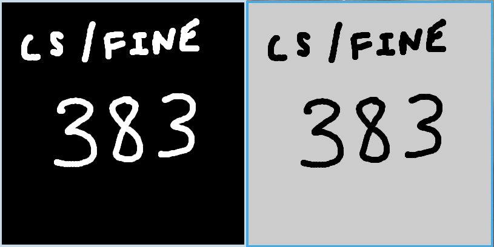
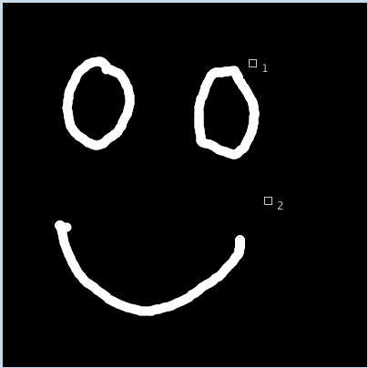

# Workshop 5: Distributed Systems

We'll explore the idea of connecting multiple sketches together and create a platform for mouse-based multi-person performance art.


## Goals

* Learn about client-server networking with simple websockets
* Brainstorm related art works


# Set Up

Make sure to complete the following steps before working with the Workshop code.

#### 1. Install required libraries

* [**Websockets**](https://github.com/alexandrainst/processing_websockets), a very simple websocket implementation for Processing.

> Use the menu `Sketch/Import Library.../Add Library...`, in the dialogue that opens, search for the library name and click "Install". 

> Post to Teams if you have trouble with set up. Please provide details so we can diagnose (e.g. operating system, error messages, steps to reproduce the error).


# Workshop

In this workshop, we'll review the different Processing code examples in this directory, and do small exercises.

## Java Socket Communication

### Sketches: **`wsserver1`** and  **`wsclient1`**

These sketches can both be run concurrently, to show how different instances of Processing can communicate with each other. Drawing with the mouse on the client window mirrors the output on the server window.



The server must be run before client, otherwise the client has nothing to connect to, and the sketch will crash. The client will also crash if the server is stopped before stopping the client.

These sketches use *websockets*, a type of communication protocol. A *socket* is essentially a point of communication that different pieces of software can connect to to share and receive messages. The server uses the code
```java
ws = new WebsocketServer(this, 3001, "");
```
to establish a socket on port 3001. The client can then connect to this socket:
```java
wsc = new WebsocketClient(this, "ws://localhost:3001");
```
`ws://localhost:3001` is the address of the socket made by the server. The websocket protocol uses the `ws://` prefix to indicate websockets. `localhost` represents that the socket is hosted on the local computer, as opposed to on the internet.

> Tip: Processing sketches on different computers can also be connected. Connect each computer to the same router, open the port being used for websocket on the server computer, and then connect to the server computer's IP (usually starts with `192.168`) with the websocket clients.

If you drag your mouse on the client window, it will draw. It will also send these drawing coordinates as a *message* to the server through the websocket:
```java
wsc.sendMessage(mouseX + "," + mouseY);
```
The `sendMessage()` method takes any string as a parameter. We use a very simple *protocol* to send the mouse coordinates: the `mouseX` and `mouseY` and joined by a comma ("`,`") as a string.

Receiving messages on the server-side is slightly more complicated. We create a function called `webSocketServerEvent(String msg)`, which is automatically called by the websockets library when a message is sent to the socket. The websocket implementation runs in a separate thread from the Processing drawing code, so we can't draw directly from this function. To be able to mirror the drawing made on the client, we need to keep track of all the coordinates that were sent since `draw()` was last called. To do this, we store the coordinates in a `ConcurrentLinkedQueue`, a type of thread-safe queue, with the `offer()` method.

Before we can mirror the drawing from the client on the server, we first have to interpret the coordinates sent from the client. We need to be able to take a string like `"123,89"` from the client and interpret it as a drawing command at coordinate (123, 89). We create a `Message` data structure to handle this conversion. The constructor takes a string, splits it at the comma, and converts the resulting numbers into `int`s. It then stores them in its own `x` and `y` fields.

Finally, to mirror the drawing in the server sketch's output window, in `draw()`, we pull all the messages off the queue using the `poll()` method, and draw an ellipse at each new coordinate.


#### Experiment

Try running two *clients* (in addition to the server) and see what happens. To do this, you'll have to duplicate the `wsclient1` script so you can run two clients.

#### Exercise

The example above demonstrates sending message from the client to the server, but we can send messages both ways! Let's create a server message to the client to send a random RGB colour whenever a key is pressed in the server sketch. Use that colour to change the client's drawing colour.

1. In the server's `keyPressed()` event function, change the string in the `sendMessage()` method to be three comma-delimited numbers for an RGB colour. (Hint: look at `mouseDragged()` in the client to format the string.)
2. Parse this RGB colour message in the client's `webSocketEvent()`, and use the three numbers to set a global fill colour variable to be used by the client. (Hint: look at the `Message` constructor in the server for parsing technique.)


### Sketches: **`wsserver2`** and  **`wsclient2`**

This pair of sketches are an expanded version of the previous pair. Each client has an id that the server keeps track of, and the server keeps track of the mouse state of each client. There are also a number of different visualizations that the server can use.

To try out this pair of sketches, duplicate the `wsclient2` script and change the `id` global variable from `1` to a different number in this duplicate. When each client sketch is run, it will show up with the corresponding id in the server sketch's output window.



To achieve this extended functionality, the `Message` data structure now expects 4 parameters: the client's id, the mouse event type (e.g., moved, pressed), and the `x` and `y` coordinates of the mouse. In the client code, we have a custom `sendMessage()` function that takes this information, joins it as a string by commas, and sends it to the socket. Each client now has an associated `InputState` data structure on the server, which keeps track of the client's mouse position and pressed state.

On the server, we have an `updateClientStates()` function that takes messages off the queue and organizes them into a `HashMap` called `clients`, mapping from client ids as strings, to `InputState`s. A visualization can then iterate through each of the clients in the `HashMap` to draw (or erase) accordingly.

<!--
#### Experiments

We'll setup a local network and try to all connect and draw at the same time.
-->

#### Visualization

Different visualizations for the server are in the `visualizations.pde` file in the `wsserver2` sketch. Change the active visualization by replacing the line
```java
Viz viz = new DrawingViz();
```
(near the top of `wsserver2.pde`) with the desired visualization. Each visualization is implemented in a different class, which makes the code more modular and easier to debug and test.

- `DrawingViz`: This is the default visualization. Each client adds to the drawing.
- `CompetitiveDrawingViz`: Each client adds to the drawing, except for one client, chosen at random, who erases instead.
- `PolygonViz`: Each client's mouse position is used as a vertex of a shared polygon.


## (EXTRA) Node.js and P5.js Socket Communication: **`nodep5`**

Daniel Shiffman has a [series of short tutorial videos](https://youtu.be/bjULmG8fqc8) explaining how to use sockets with Node.js and P5.js. 

Other related references:

https://github.com/antiboredom/websocket-p5

https://github.com/processing/p5.js/wiki/p5.js,-node.js,-socket.io

# Digital Sketchbook Exercise

Create a simple, multi-person, mouse-based artwork based on the communication capabilities of the socket code framework. Capture and include a short video of your artwork, and provide a brief (approx. 250 word) description of the artwork and how you use sockets within your artwork.

