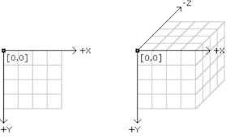
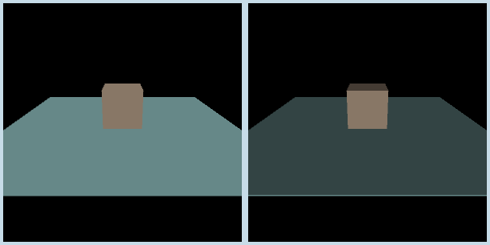
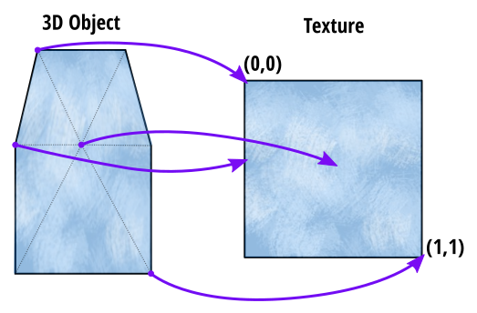

# Workshop 6: 3D Graphics

We'll explore how to use p5.js's WebGL mode to construct and render 3D objects, control cameras and lighting, and do texture mapping.

## Goals

- Position objects and a camera within a scene
- Control lighting for a scene
- Create 3D objects using vertices
- Load 3D objects from external files
- Add a texture of a 3D object using UV maps
- Changing 3D object textures in real-time

_No pre-workshop setup is necessary._


# Workshop

In this workshop, we'll review the different p5.js code examples and do small exercises.

## 3D Basics

### Sketches: **`boxrotate`**

This sketch demonstrates the basics of setting up your canvas for 3D graphics, drawing 3D primitives, and using 3D transformations.

To put p5.js in 3D mode, `WEBGL` needs to be passed as a third argument to the `createCanvas()` function:
```javascript
createCanvas(w, h, WEBGL);
```
From this point on, p5.js will be able to use drawing commands with 3 parameters: `x`, `y`, and now `z`.

`x` goes towards the right, `y` goes downward, and `z` comes in the direction out from the screen towards you. This is often called a "left-handed" coordinate system, which is what game engines often use, but which is different from the "right-handed" coordinates you might be used to from vector math.



In WEBGL mode, position (0,0,0) is the **centre** of the canvas, rather than the top-left.

Similar to how p5.js includes build in functions for drawing shapes in 2D, like `ellipse()` and `rect()`, it also provides some simple 3D primitives:
- `box(w,h,d)` or `box(s)`: Draws a rectangular prism with width `w`, height `h`, and depth `d`; or a cube with side length `s`.
- `sphere(r)`: Draws a sphere with radius `r`.

You can use `noStroke()` to give shapes a solid look, or `noFill()` to give shapes a "wireframe" look. p5.js's usual transformation functions also work for 3D objects, but have an additional `z` parameter:
- `translate(x,y,z)`
- `scale(x,y,z)` (*Note: This also scales the stroke weight, which can look weird for large values.*)
- `rotateX(t)`, `rotateY(t)`, `rotateZ(t)`

#### Experiments

1. Add the code below to draw a "2D" line right after the box, what happens? Why?
```javascript
line(0, -75, 0, 75);
```
2. Before the `rotateX/Y()` lines, add the following line of code. What happens? Why?
```javascript
translate(0, 0, mouseX - 100);
```

## Cameras and Lights

### Sketch: **`cameras`**

This sketch demonstrates interactive control of a virtual 3D camera and basic lighting. It draws a box on a plane, and lets you control various camera parameters. By default, `mouseY` controls the camera distance and `mouseX` controls the camera x-position. While holding down the `1` key, `mouseY` controls the camera's field of view. While holding down the `2` key, `mouseX` controls the "roll" of the camera (which way is "up").

Setting up the viewport camera involves calling the 
```javascript
camera(
    eyeX, eyeY, eyeZ,
    centerX, centerY, centerZ,
    upX, upY, upZ)
```
function. It takes three sets of coordinates. The first set, `eye*`, is the position of the camera in the scene. The second set, `center*`, is the point at which the camera is looking in the scene. The third set, `up*`, is the "up" direction of the camera, and is usually set to (0, 1, 0) for a typical upright scene.

The `perspective(FOVy, aspect, zNear, zFar)` function is used to configure the perspective projection parameters of the camera. `FOVy` controls the field-of-view angle of the camera. A wider field of view is more like a fisheye lens, whereas a narrower field of view is more like a telephoto lens. `aspect` controls the aspect ratio of the projection, and should nearly always be set to `width/height`. `zNear` and `zFar` represent the *clipping planes* of the camera. Any parts of objects nearer than the near clipping plane or farther than the far clipping plane will not be rendered.

This sketch uses the simple `lights()` function to provide a basic level of shading to the 3D objects in the scene (right image). Without a light source in the scene, objects are shaded in a single colour (left image):




### Sketch: **`pointlights`**

This sketch demonstrates controlling virtual lights and setting material properties. Press the `r` key to rotate the torus, or the `l` key to move the lighting source. Press `m` toggle whether the material is "specular", and press `s` to control the shininess of the specular reflections.

Unlike the previous sketch, which uses `lights()` to automatically light the scene, this sketch uses a manual combination of ambient lighting and a point light. Ambient light is set using the `ambientLight(colour)` function. The ambient light is a base level of environmental lighting that gives an underlying colour to all the objects in the scene. A point light is configured using the `pointLight(colour, x, y, z)` function. A point light illuminates objects as if you have a small lightbulb at the given coordinates.

> p5.js also provides [spotlights](https://p5js.org/reference/#/p5/spotLight) (`spotLight()`) and [directional lights](https://p5js.org/reference/#/p5/directionalLight) (`directionalLight()`).

This sketch also configures two additional parameters. The first is the colour of specular light, using `specularColor(colour)`. This is the colour of mirror-like reflected light that makes highlights on objects. The second is `shininess(s)`, which controls how glossy the surface of the object is.

#### Experiment

Try changing the colour values of `ambientLight`, `specularColor`, and `pointLight` to see what kinds of effects you can make.


## Constructing and Texturing 3D Objects

### Sketch: **`pyramidshape`**

This sketch builds a pyramid out of vertices and allows you to rotate it.

`beginShape()` and `endShape()` can be used in 3D, just like in 2D, but `vertex(x,y,z)`, now has an additional `z` parameter. You can pass a *mode* to `beginShape(mode)` to make assembling the shapes easier. In this sketch, we use the `TRIANGLES` mode, which makes each triplet of vertices into a triangular face.

> Note: There are other modes, like `TRIANGLE_STRIP`. This mode connects each new vertex to the previous two, forming a triangle. All modes come directly from OpenGL, the graphics mode that p5 is using with the `WEBGL` parameter to `createCanvas()`. For more information about modes, have a look at [p5's documentation](https://p5js.org/reference/#/p5/beginShape) and the diagram on [this computer graphics course website](http://www.dgp.toronto.edu/~ah/csc418/fall_2001/tut/ogl_draw.html).


#### Experiment

Uncomment the commented `translate()` line. How would you change this line to make the pyramid rotate about its top?


### Sketch: **`texturecustomshape`**

This sketch demonstrates how to use *textures* to add details to surfaces of 3D objects. The sketch creates a simple waterfall shape, and applies an image texture to it. Set the `animate` global variable to true to see the waterfall flow.

To texture an object, we first create the texture from an image file. It's just a normal `p5.Image`:
```javascript
let texture;
...
texture = loadImage("waterfall.jpg");
```
Then, to set the texture of the object, we call `texture()` just after `beginShape()`:
```javascript
beginShape(TRIANGLE_FAN);
texture(texture);
...
endShape();
```

The final step to texturing is to indicate how the image is stretched across the 3D object. This is called *UV mapping*. You can think of this like creating a projection of the Earth's surface using latitude and longitude, to make a 2D map.



By running `textureMode(NORMAL);` in `setup()`, we normalize the texture onto a 1x1 square. We can then map the points on the 3D object to points in this texture space, using the `u` and `v` parameters of the `vertex()` function. Consider the line in the sketch:
```javascript
vertex(100, 150, 50,   0.5, offset(0.5));
```
If we ignore `offset` for a moment, this becomes:
```javascript
vertex(100, 150, 50,   0.5, 0.5);
```
This code is creating a vertex in the 3D waterfall at (100, 150, 50), but also mapping it to (0.5, 0.5), a point in the 2D texture, halfway across and halfway down. By specifying the UV coordinates for each vertex, the texture will be stretched over the surface of the object.

If we return to the `offset()` function now, if the `animate` global variable is set to `true`, this causes the return value to be offset by `currentOffset`, which increases each frame. In this way, textures can be animated along the surface of an object by changing the UV mapping over time.


#### Experiments

1. Comment out both of the `translate(0,0,1);` lines, what happens? Why?
2. Try making the waterfall texture animate in a different direction (e.g., sideways).


### Sketch: **`videotexture`**

This sketch shows how to use a video as a texture on a 3D object. The sketch shows the live camera footage on a rotating 3D cube.

The texture is created by passing the current video frame (`video.get()`) to `texture()` before drawing the cube.


## Loading and Texturing External 3D Objects

### Sketch: **`simplemodel`**

This sketch is the same as the `boxrotate` sketch above, but it displays a 3D skull model loaded from a file, rather than a cube.

The `loadModel()` built-in function is able to load OBJ or STL files, two types of 3D model file:
```javascript
let mesh;
...
mesh = loadModel("tinker.obj");
```
We can then use transformations to translate and rotate the model in 3D space, and then use `model()` to render the mesh.


### Sketch: **`modelsin3d`**

This sketch demonstrates how a model created in Blender, a free, open-source 3D graphics program, can be loaded and used in p5.js.

This sketch loads the 3D object in the same way as the `simplemodel` sketch. We can use `texture()` to specify the texture for the model.

> Note: Some 3D systems (e.g., Java Processing) automatically load the MTL (material) file that indicates the texture that belongs to the OBJ file. p5.js does not do this, so the texture needs to be loaded manually.

#### Experiment

Find an object online, or create your own, then try to import it in p5.js. Avoid very detailed or complex models.


## Other Notes

- p5.js has very limited built-in support for matrix transformations; doing transformations from screen-space to world-space, etc., need to be done manually
- p5.js has support for custom [shaders](https://p5js.org/reference/#/p5/shader), which can be used to create sophisticated effects
